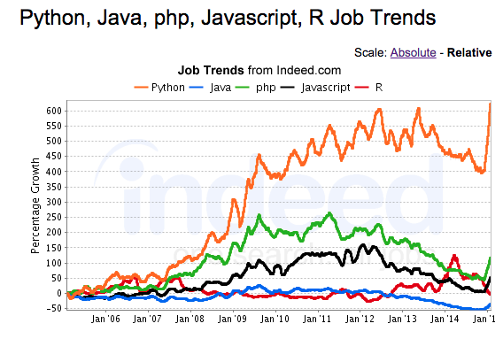

   
[TOC](https://github.com/txt/mase/blob/master/TOC.md) |
[At a glance...](https://github.com/txt/mase/blob/master/OVERVIEW.md) |
[Syllabus](https://github.com/txt/mase/blob/master/SYLLABUS.md) |
[Overview](https://github.com/txt/mase/blob/master/ABOUT.md) |
[Models](https://github.com/txt/mase/blob/master/MODELS.md) |
[Code](https://github.com/txt/mase/tree/master/src) |
[Lecturer](http://menzies.us) 

# MASE:  (Model-based) Automated   Software Engineering

Welcome to MASE (rhymes with "base", pronounced like "mace").

MASE is about
the wide wild   world of _Research Programming_:

+ Step 1: codify your current understanding of "it" into a model.   
+ Step 2: reason about that model.

 
MASE changes the nature and focus and role of
software engineering:

+ Traditionally, software engineering is about services
  that meet requirements.
+ But with MASE, software engineering is less about
  service than about search. MASE's goal is discovery 
  of interesting features in existing models
  (or  perhaps even the evolution of entirely 
  new kinds of models).

For example, other CS classes might explore small
things like strings or "hello world". But with MASE,
we explore **BIG** things like String Theory or
"hello world model of climate change and economic
impacts".

## Why Study MASE?

+ If you interested in general methods 
  for being a better scientist,
  then there are
  [many reasons to study MASE](#science).
+ If you are an industry-focused individual, there are
  [other reasons to study MASE](#career) to improve your
  skills and your productivity.
+ Finally if  you are fascinated by 
  wild and fantastic and profound ideas,
  then [you should also study MASE](#ideas).

## <a name=science>Be an Agile Research Programming</a>

Research programming is 
the future of SE. 

+ In traditional manual software engineering,
  engineers laboriously convert (by hand)
  non-executable paper models into executable code.  
+ MASE about a new kind of SE which
  relies, at least in part, on executable models.  In
  this approach, engineers codify the current
  understanding of the domain into a model, and then
  study those models.

Many of these new SE models are delivered as part of
working systems.  Those models now mediate nearly
all aspects of our lives:

+ If you
  live in London or New York and need to call an
  ambulance, that ambulance is waiting for your call
  at a location pre-determined by a model. 
+ If you cross from Mexico to Arizona,
  a biometrics model  decides if you need
  secondary screening.
+  The power to make your toast comes from a
  generator that was spun-up in response
  to some model predicting your future electrical
  demands.
+ If you fly a plane, extensive
  model-based software controls many aspects of
  flight, including what to do in emergency
  situations.
+ If you have a heart attack, the
   models in the defibrillator will
  decide how to shock your heart and lungs so that
  you might live a little longer.

Given recent advances in computing hardware,
software analysts either validate these models or
find optimal solutions by using automatic tools to
explore thousands to millions of inputs for their
systems.  Note that such tools work much faster than
humans.  Without automated tools, it can take days
for human experts to review just a few dozen
examples.  In that same time, an automatic tool can
explore thousands to millions to billions more
solutions.

This has implications of changing the nature of
human exploration of the world around them. As
Philip Jia Guo says in his [Ph.D.
dissertation](http://purl.stanford.edu/mb510fs4943):

<em>People across a diverse range of science, engineering, and business-related disciplines
spend their workdays writing, executing, debugging, and interpreting the outputs
of computer programs. Here are some examples of such "research programming":

+ _Science:_ Computational scientists in fields
ranging from bioinformatics to neuroscience write
programs to analyze data sets and make scientific
discoveries.
+ _Engineering:_ Engineers perform experiments to
optimize the efficacy of machine learning algorithms
by testing on data sets, adjusting their code,
tuning execution parameters, and graphing the
resulting performance characteristics.
+ _Business:_ Web marketing analysts write programs
to analyze clickstream data to decide how to improve
sales and marketing strategies.
+ _Finance:_ Algorithmic traders write programs to
prototype and simulate experimental trading
strategies on financial data.
+ _Public policy:_ Analysts write programs to mine
U.S. Census and labor statistics data to predict the
merits of proposed government policies.
+ _Data-driven journalism:_ Journalists write
programs to analyze economic data and make
information visualizations to publish alongside
their news stories.</em>

In one form of the above, the "research programmer"
builds and explores models-- which can be a complex
process that this subject aims to simplify.

**Be a Stats Guru**:
MASE requires that we know better ways to understand
complex Phenomena.  
Hence, skilled practitioners of MASE, know 
much about practical, fast, large-scale statistical methods. 

**Be a Better Scientist:**
MASE is an excellent way
 hone your skills as a scientist as well as
your critical thinking prowess.
MASE teaches us much  about
empirical methods and how to sample and test complex
phenomena. For example, MASE practitioners
  understand the
_variability_ of any conclusion made by any
scientific method (e.g. when someone
offers  a conclusion, the experienced MASE programmer
always be "yes, but how
brittle is that conclusion to changes in
conditions?").  

**Be More Agile:** 
Humans learn best (and fastest)
via feedback from direct feedback from the
domain. That is is true of agile software
development as well as something else I want to call
_agile research programming_:

+ The research programmer tackles problems at a much
higher level than a programmer.  
+ While agile
programmers debug string functions, agile scientists
debug theories.

As such, the agile research programmers tests ideas
more and changes their mind more as they evolve a
better undestandng of some phenomenon.

## <a name=career>Career Security</a>

**Be Ahead of the Curve!:** What is the next "big
  thing" after "big data"? Well, after "data
  collection" comes "model construction" so the next
  big thing after big data will be "big
  modeling". In this subject, students will learn
  how to represent, execute, and reason about
  models. Our case studies will come from software
  engineering but the principles of this subject
  could be applied to models in general.

**Be employed!! For decades to come!!:**
This subject will make you  be the world's greatest Python programmer.  And that is no bad thing:

But also, this subject could also help you stay ahead of the game for decades to come.

##  <a name=ideas>MASE and the Future of Ideas</a>

MASE is about some fantastic, profound, and amazing ideas.

**Evolutionary-based Computing:**
The main tool of MASE are  algorithms that explore (and sometimes combines) multiple randomly selected solutions to a program. Such evolutionary methods are very cool indeed. In 2012, the website Edge.org asked noted scientists the following question:

+ [What is your favorite deep, elegant, or beautiful explanation?](http://edge.org/responses/what-is-your-favorite-deep-elegant-or-beautiful-explanation)

They received dozens of answers and fully a third of those responses related to evolution and natural selection. The reason was clear- in terms of requiring the least machinery and explaining the most observations, hands down, evolution is the theory of the last 200 years.

What you get with this simple approach is quite a lot. With this kind of computation, you get:

+ Simple implementation: lots and lots of small devices;
+ Easy, coarse-grain co-ordination of effort;
+ Distributed computation, which can be parallelized;
+ Robust networks: that can survive attack and insult and death of some large percent of the network;
+ Adaptability and the generation of new ideas that have not been explored before;

What else offers so much from so little? So one reason to explore search-based SE is that it an explanation of an powerful engineering principle that has had (and will continue to have) a massive impact on this planet.

**Data Mining and Optimization:**
The more I code search algorothm and data miners, the more the code base becomes similar. Its like, under the hood, these things actually do the same thing. 

Now this is not a new insight. Much prior work has commented on the profound connection between data mining and optimization. Both discover then summarize interesting regions of the data. Optimizers can then resample from that region to create new data (while data miners may have to stop at that point since there are gaps between its training data).

But what I think we are close too is a unification of data mining and optimization into one higher-level framework that will simplify both approaches. I think. Maybe. Come help me bumble around on this one and tell me what you think.

### History and Future of   MASE

#### History

Recall the above definition: MASE has two steps (1)   codify your current understanding of "it" into a model; then  
(2)   reason about that model.
It turns out that MASE is the oldest activity in computer science. In fact, it was the reason that
computers were invented in the first place. To explain that, we need to go back in time to before there was SnapChat, Twitters, Facebook, the Internet, TCP/IP, operating systems, programming languages, color TV....

The lesson of the 20th century is that this kind of hard-to-explore trade-off is unavoidable. For centuries, philosophers and scientists explored the Platonic goal of total rational decisions. That fell apart when:

+ Godel's 1930 incompleteness theorem showed that in any interesting axiomatic system (where "interesting" means "able to at least support integer arithmetic") there exists conclusions that are true, but not reachable from the premises.
+ Turing's 1937 work on the halting problem showed that, in the general case, it is not possible to decide beforehand whether or not a computer program is "hard" or "easy" (where "easy" meant "will finish processing some arbitrary input"). More specifically, the halting problem is undecidable over a Turing machine (a general description of all computational processes).
+ While this sounds like very bad news, it had a curious and profound side effect. For Godel and Turing to make their conclusions, they first had to precisely define what it meant to do "computing". That definition was precise enough to allow for the construction of the post-WWII new generation of general computers. For example, after the war at the Institute for Advanced Studies at Princeton, the engineers designing the next generation of general-purposes computers literally tore apart Turing's books (since they read them so obsessively).
+ So in a very real sense, the  legacy of Turing and Godel's work on "limits to computing" was actually a statement of "how to compute". Sure, that computational process had limits but between current human ignorance and those eventual limits lay a very useful middle zone. And in that zone, since WWII, we have built UNIX, the Internet, the open source revolution, social and ubiquitous computing, Google, Facebook, Microsoft, etc etc.

One of the first pioneers to use Turing and Godel's work was John Von Neumann. Von Neumann was a towering figure in the history of the 20th century. Apart from his seminal contributions to the mathematics of shaped charges, geometry, measure theory, ergodic theory, operator theory, lattice theory, mathematical formulation of quantum mechanics, quantum logic, game theory, mathematical economics, linear programming, mathematical statistics, fluid dynamics, weather systems, etc, etc, etc, etc he also lead the computer work at Princeton's Institute for Advance Studies. He was the one who told his engineers to read Turing in such great detail. He was also a great fan of Godel's work. In his book [Turing's Cathedral](http://www.amazon.com/Turings-Cathedral-Origins-Digital-Universe-ebook/dp/B005IEGK5C), Geroge Dyson documents the extraordinary efforts of Von Neumann in rescuing Godel from the pre-WWII chaos in Europe (after which, he gave Godel an office two doors down from his at Princeton).

Von Neumann was the one of the first to fully appreciate the engineering implications of Turing and Godel's work. In summary, he realized that thanks to Godel and Turing, **rationality had just become an experimental science**. Given that we cannot guarantee what happens when we fire up a computer program, all we can do is "try it and see" what happens next.

Von Neumann's Princeton group was very successfully in selling this idea to the American government. As a result, they had funds to build the computers needed for very large scale "try it and see" studies. At the height of their research in the 1950s, they were simulating everything from weather effects to stars to atomic bombs:

+ Stellar evolution: simulating the lifetime of the sun, over 1014 years;
+ Biological evolution: simulation the human life space, over 30 years;
+ Meteorology: simulating 8 hours of atmospheric effects;
+ Shock waves in ballistic: simulating events that happen in the blink of an eye;
+ Nuclear explosions: simulating events over the lifetime of a neutron in a nuclear explosion (a mere 10-8) seconds).

#### Future

While MASE is very old, it still has numerous pressing problems and open issues:

+ **Who writes the models?** Models are software and like any other piece of software, there is a skill in creating models that are undestandable and maintainable. The good news is that with the recent upsurge in interest in programming
(e.g. ["everyone should program"](https://www.youtube.com/watch?v=nKIu9yen5nc)) there are now more people able to build and maintain modeks.
+ **How to commission a  model?**   Building a detailed model   might actually be the first time some community has ever tried to commit to the details of their shared views. So one of the challenges of AuMoBase is helping users develop a shared and mature view of their own world. This is not an easy task.
+ **How to trust a model?** Any model is an inaccurate abstraction of reality. When are the inaccuracies too unrealistic?
+ **How to fill in the model?** Many models use magic variables to operationalize the weight of some variable on another. Often, those weights are set by _engineering judgement_ (i.e. we make them up). Can we do better than that?
+ **How to run the model?** This is getting easy but there is still is an issue with slow models on how to get enough CPU time to sample the slower models-- particularly if you want to conduct repeated runs to test the stability of the conclusions reached from those models.
+ **How to trade off the goals?** Once models get more complicated, they usually offer comments on competing goals; e.g. infinitely effective health care is infinitely expensive- so where to draw the line?  In the last ten years  there has been much progress on multi- and many- objective reasoning. But this is still an area that requires further investigation.
+ **How to maintain the models?** Once built, the models have to be maintained-- again and again and again. And this is not a simple task. Old conclusions may need to be revisited and rechecked if the new model reverses older decisions. Small models grow into complex monsters with all too many special cases and quirks. 
+ **How to scope the models?**   While this  subject advoated using models, it has to be said that if they are used out-of-scope, then models become very dangerous. Models reflect the experience of the modeler or the training data used to build the model. When models are applied outside of that experience base, disasterous consequences can follow (e.g. [the model that
killed seven American astronauts](http://spaceflightnow.com/columbia/report/inflight.html)).

_________

Copyright © 2015 [Tim Menzies](http://menzies.us).
This is free and unencumbered software released into the public domain.   
For more details, see the [license](https://github.com/txt/mase/blob/master/LICENSE).

