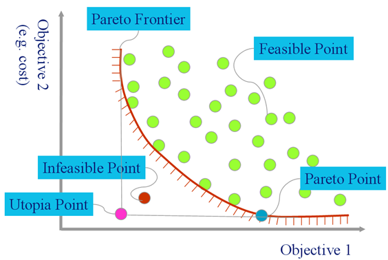

   
[At a glance...](https://github.com/txt/mase/blob/master/OVERVIEW.md) |
[Syllabus](https://github.com/txt/mase/blob/master/SYLLABUS.md) |
[Models](https://github.com/txt/mase/blob/master/MODELS.md) |
[Code](https://github.com/txt/mase/tree/master/src) |
[Lecturer](http://menzies.us) 

[[etc/img/leftarrow.png]]   [Back   to SBSE'14](Home)

Differential Evolution
======================

From [http://en.wikipedia.org/wiki/Differential_evolution](http://en.wikipedia.org/wiki/Differential_evolution).

Differential evolution (DE) is a method that
optimizes a problem by iteratively trying to improve
a candidate solution with regard to a given measure
of quality. Such methods are commonly known as
metaheuristics as they make few or no assumptions
about the problem being optimized and can search
very large spaces of candidate solutions. However,
metaheuristics such as DE do not guarantee an
optimal solution is ever found.

DE is used for multidimensional real-valued
functions but does not use the gradient of the
problem being optimized, which means DE does not
require for the optimization problem to be
differentiable as is required by classic
optimization methods such as gradient descent and
quasi-newton methods. DE can therefore also be used
on optimization problems that are not even
continuous, are noisy, change over time, etc.

DE optimizes a problem by maintaining a population
of candidate solutions and creating new candidate
solutions by combining existing ones according to
its simple formulae, and then keeping whichever
candidate solution has the best score or fitness on
the optimization problem at hand. In this way the
optimization problem is treated as a black box that
merely provides a measure of quality given a
candidate solution and the gradient is therefore not
needed.

Invented by:

+ Storn, R.; Price, K. (1997). "Differential
evolution - a simple and efficient heuristic for
global optimization over continuous spaces". Journal
of Global Optimization 11:
341-359. doi:10.1023/A:1008202821328.

+ Storn, R. (1996). "On the usage of differential
evolution for function optimization". Biennial
Conference of the North American Fuzzy Information
Processing Society (NAFIPS). pp. 519-523.

For further  information:

+ [Differential Evolution Home page](http://www1.icsi.berkeley.edu/~storn/code.html)
+ Includes DE implementations in dozens of languages.

## DE's Intuitions

When building a new population, do not just add promising
members into the old:

+ That way leads to over-population (computationally slower);
+ Instead, if you find something better, jettison something else.

When finding the frontier, do not do all pairs comparison

+ Too slow
+ Instead, compare frontier to randomly generated items
     + Replace any dominated ones
	 

When building new candidates, extrapolate between
members of the current frontier:

+ No needs for frequency tables of better ranges
    + The frontier _has_ the better ranges;
+ Pick three things (X,Y,Z);
+ At some probability (called the crossover factor):
    + _New = X + f * (Y - Z)_
    
## Code

Warning: pseudo-code only. Never executed.
    
### Some model feature selectors

Somehow, your models need to be able to report themselves as follows.

Ranges for decision _d_:

    def lo(d): # return max range of decision d
    def hi(d): # return min range of decision d
    
List of decision indexes:

    def decisions(): # return list of indexes of the decisions

Making sure something is in range:

    def trim(x,d)  : # trim to legal range
      return max(lo(d), min(x, hi(d)))

Creating a new candidate. Candidates are things with
_id,score_. They also  _have_ some decisions
which
are initialized at random from _lo_ to _hi_.

	def candidate():
	  something = [lo(d) + n(hi(d) - lo(d)) 
	               for d in decisions()])
	  new = Thing()
	  new.have  = something
	  new.score = score(new)
	  return new

    def n(max):
      return int(random.uniform(0,max))

    class Thing():
	  id = 0
      def __init__(self, **entries): 
	   self.id = Thing.id = Thing.id + 1
       self.__dict__.update(entries)

Scoring one member in a population:

    def score(one):
      # returns distance from hell (combination of all objectives)
	
  
### Differential Evolution
    
Main function (which looks like any other evolutionary optimizer)
creates an frontier, tries to update it, stopping if we are good enough:

    def de(max     = 100,  # number of repeats 
           np      = 100,  # number of candidates
    	   f       = 0.75, # extrapolate amount
    	   cf      = 0.3,  # prob of cross-over 
		   epsilon = 0.01
    	   ):
      frontier = [candidate() for _ in range(np)] 
	  for k in range(max):
		total,n = update(f,cf,frontier)
		if total/n > (1 - epsilon): 
		  break
      return frontier
	  	  
Action at each iteration. Make sure we have a score
for the old timer on the frontier.  If some newly
created candidate is better than the old timer, then
replace the old timer with the new candidate (and
update the cache of scores). Returns the total
of scores of the frontier (and its size).
	  
    def update(f,cf,frontier, total=0.0, n=0):
	  for x in frontier:
	 	s   = x.score
		new = extrapolate(frontier,x,f,cf)
        if new.score > s:
		  x.score = new.score
		  x.have  = new.have
		total += x.score
		n     += 1
	  return total,n

Note one design choice in the above: better mutants
get added into the frontier as soon as we find them;
i.e. during one pass over the frontier, it might be
possible to revisit mutations made earlier in that single
pass.

The core DE extrapolation-based mutator.
Alters a field at probability _cf_,  _X + f*(Y - Z)_. 

    def extrapolate(frontier,one,f,cf):
	  out = Thing(id   = one.id, 
	              have = copy(one.have))
	  two,three,four = threeOthers(frontier,one)
      changed = False  
      for d in decisions():
	    x,y,z = two.have[d], three.have[d], four.have[d]
		if rand() < cr:
    	  changed = True
    	  new     = x + f*(y - z)
    	  out.have[d]  = trim(new,d) # keep in range
      if not changed:
        d      = a(decisions())
        out.have[d] = two[d]
	  out.score = score(out) # remember to score it
      return out 

In the above code, note the use of the _changed_
variable that assures us that at least one new value
is introduced into _out_.

Finally, one small detail. The function _threeOthers_
finds 3 items from frontier that are different
to the parent we might be replacing. For our
definition of _different_, we will use that _id_
value
stored in our candidate:

    #Returns three different things that are not 'avoid'.
    def threeOthers(lst, avoid):
	  def oneOther():
	    x = avoid
	    while x.id in seen: 
	      x = a(lst)
	    seen.append( x.id )
	    return x
      # -----------------------
	  seen = [ avoid.id ]
      this = oneOther()
	  that = oneOther()
	  theOtherThing = oneOther()
      return this, that, theOtherThing

	
    def a(lst) :
      return lst[n(len(lst))]

## Storn97's  Parameter Recommendations

The _CR_ has  range one to zero.

+ Try _CR_=0.3
+ If no convergence, try _CR_ in the range 0.8 to 1

For many applications:

+ _NP_=10* number of decisions. 

_F_ is usually chosen 0.5 to 1.

+ The higher the population size NP is chosen, the lower _F_.

## Variants of DE

DE is actually a family of algorithms, all doing similar
things to the above.

Recall that the above DE mutated as follows:

+ _X + F*(Y - Z)_

Storn denotes DE variants as _DE/selection/extrapolations_.
For example, the above DE is actually DE/rand/1; 
     
+ We extrapolate from some candidate _X_, chosen at random.
+ We only add in values from one other extrapolation

DE/best/2 would use two extrapolations, but based on the
  best _X_ seen so far:

+ _Xbest + F * (A + B - Y - Z)_
+ Here, _A,B,Y,Z_ are candidates selected at random

DE/rand-to-best/1 places the perturbation at a location 
  between a randomly chosen population member and the best
  population member: 

+ _X + D*(Xbest - X) + F*(Y - Z)_
+ Here, _D_ is some number 0..1

DE/closest/1 would select _X_ to the instance
  closest to the parent we are considering replacing. 
  How to measure closeness? Well:
  
+ DE/closest(dec)/1 would find the closest in decision space;
+ DE/closest(obj)/1 would find the closest in objective space;
 
I leave it to your imagination to invent new DE variants.
But note the computational cost of the above:

+ The _best_ variants can be fast since the only extra stuff
  here is to test each new candidate as it is created and 
  remember the best seen so far (that takes linear time).
+ The _closest_ variants can be very slow: all those distance
  calculations! (and much slower in decision space than objective space: why?).
  
 

_________

Copyright © 2015 [Tim Menzies](http://menzies.us).
This is free and unencumbered software released into the public domain.   
For more details, see the [license](https://github.com/txt/mase/blob/master/LICENSE.md).

