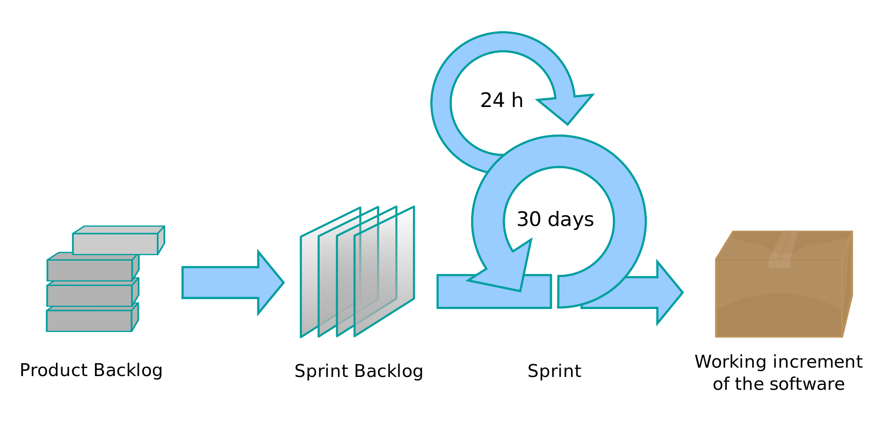
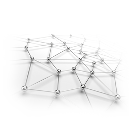
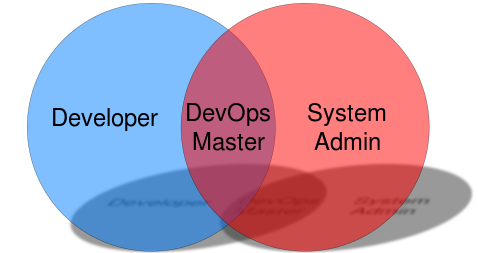

   
[At a glance...](https://github.com/txt/mase/blob/master/OVERVIEW.md) |
[Syllabus](https://github.com/txt/mase/blob/master/SYLLABUS.md) |
[Models](https://github.com/txt/mase/blob/master/MODELS.md) |
[Code](https://github.com/txt/mase/tree/master/src) |
[Lecturer](http://menzies.us) 

# Pumping the Gas Before Starting the Car

 <table width="850">

      <tr>
        <td id=black align="center"  width=200  valign="middle"
            bgcolor="yellow">
	  <a href="se/index.html">
	    <h3>Software Engineering</h3>
	     beginner, intermediary</a>
	</td>
        <td align="center" width="50" valign="top" yellow=""></td>
        <td id=black  align="center"width=200 valign="middle" bgcolor="orange">
	  <a href="ase/index.html">
	    <h3>Automated SE</h3>

         advanced, expert</a></td>

<td align="center" width="50" valign="top" yellow=""></td>
<td id=black align=center width=200 valign="middle" bgcolor=lightblue>
<a href=""><h3>Dev Ops</h3>

 
the post-agile world</a>
</td>
</tr>

</table>
_Education is not the filling of a pail, but the lighting of a fire._
--William Butler Yeats

_If the World merely lived up to our wildest dreams, what a rdull place it would be. Happily..._
--Me

_The best thing for being sad," replied Merlin, beginning to puff and blow, "is to learn something. That's the only thing that never fails. You may grow old and trembling in your anatomies, you may lie awake at night listening to the disorder of your veins, you may miss your only love, you may see the world about you devastated by evil lunatics, or know your honour trampled in the sewers of baser minds. There is only one thing for it then — to learn. Learn why the world wags and what wags it. That is the only thing which the mind can never exhaust, never alienate, never be tortured by, never fear or distrust, and never dream of regretting. Learning is the only thing for you. Look what a lot of things there are to learn.”_   
--Merlin in _The Once and Future King_

_________

Copyright © 2015 [Tim Menzies](http://menzies.us).
This is free and unencumbered software released into the public domain.   
For more details, see the [license](https://github.com/txt/mase/blob/master/LICENSE.md).

