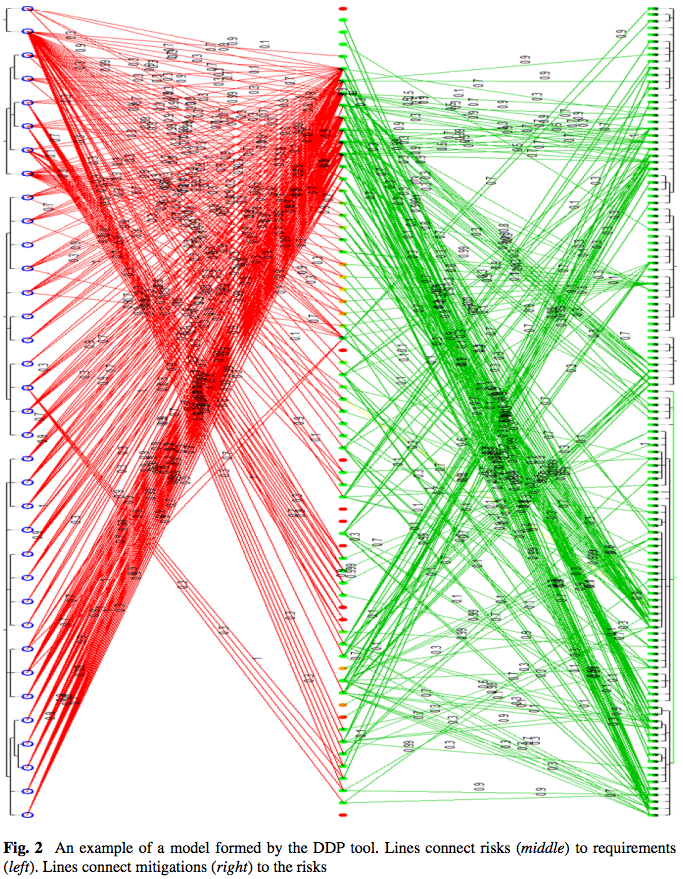
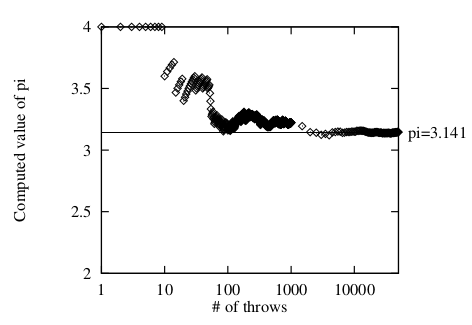
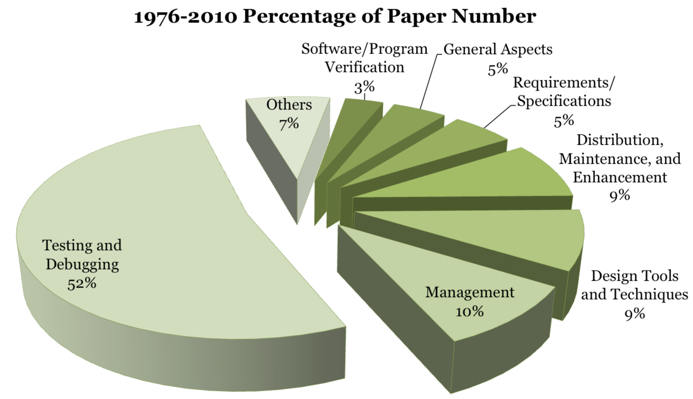

   
[TOC](https://github.com/txt/mase/blob/master/TOC.md) |
[At a glance...](https://github.com/txt/mase/blob/master/OVERVIEW.md) |
[Syllabus](https://github.com/txt/mase/blob/master/SYLLABUS.md) |
[Models](https://github.com/txt/mase/blob/master/MODELS.md) |
[Code](https://github.com/txt/mase/tree/master/src) |
[Lecturer](http://menzies.us) 

# Search Space

## Questions of Balance

The human condition is a constant balancing act
between vaguely understood, often competing,
goals. For example:

For another (software related) example:

+ Lets build the software faster...
+ ... with few bugs ...
+ ... using less budget.

For the sad consequences of this "better, faster, cheaper" policy, read the sad story of NASA's loss of the [Mars
Polar Orbiter](http://en.wikipedia.org/wiki/Mars_Climate_Orbiter) at a net wasted cost of over
$300 million dollars.

For yet another example, consider the problem of
design. Design, [says Herbert Simon][simon96] (one
of the founder fathers of AI) is "the quintessential
human activity". Simon characterized design as a
_satisficing_ task; i.e. a combination of satisfy
and suffice. Satisficing is the cognitive heuristic
that searches through available a space of competing
constraints, until an acceptability threshold is
met.

[simon56]: http://goo.gl/ "Simon, H. A. (1956). 'Rational Choice and the Structure of the Environment'. Psychological Review 63 (2): 129–138. doi:10.1037/h0042769."

[simon96]: http://goo.gl/DyWA9A "Herbert A. Simon. 1996. The Sciences of the Artificial (3rd Ed.). MIT Press, Cambridge, MA, USA."

For example , consider labyrinth of choices
explored by satellite designers at NASA's Jet
Propulsion Laboratory. In their Team X meetings,
dozens of experts in propulsion, communications,
guidance and control etc meet for week-long sessions
to thrash out possibilities for NASA's next deep
space mission.

In these meetings it is possible for groups sitting
at one side of the room to make decisions that
impact sitting somewhere else. To address this
problem,
[Martin Feather developed a graphical notation][10keys]
of the _requirements_ being explored, the _risks_
that everyone thinks might damage those
requirements, and the _mitigations_ that might be
put in place to reduce those risks. After a few
days, those diagrams can very complex, particularly
if you are seeking the least cost combination of
mitigations that retire the most risks (thus
enabling the most requirements):

[10keys]: http://menzies.us/pdf/10keys2.pdf " Gregory Gay, Tim Menzies, Omid Jalali, Gregory Mundy, Beau Gilkerson, Martin Feather, James Kiper, Finding robust solutions in requirements models Automated Software Engineering March 2010, Volume 17, Issue 1, pp 87-116"

# How to Try it and See

Recall from [our introduction](ABOUT.md) that Johm
Von Neumann realized
that in the 1940s,  **rationality had just become an experimental science**.
Given that we cannot guarantee 
what happens when we fire up a computer program, all we can do is "try it and see" what
happens next. 

Recall that Von Neumann's Princeton group was very successfully in selling this
technology to the American government. At the height of their research in the 1950s, they were simulating
everything from weather effects to stars to atomic bombs:

+ Stellar evolution: simulating the lifetime of the sun, over 1014 years;
+ Biological evolution: simulation the human life space, over 30 years;
+ Meteorology: simulating 8 hours of atmospheric effects;
+ Shock waves in ballistic: simulating events that happen in the blink of an eye;
+ Nuclear explosions: simulating events over the lifetime of a neutron in a nuclear explosion (a mere 10-8) seconds).

Using that all simulation experience, Von Neumann's group invented simulation techniques that are still used today.

### Monte Carlo Simulation

For example, consider _Monte Carlo_ simulation.
This is an interesting approach to **watch and see**
where a simulation tries out thousands or
possibilities select by chance (by means of a
"random number" with suitable probability), then
follow the fate of that selection in a line (instead
of exploring all branches).  It is
[possible to show that, using this algorithm, deviations from the canonical distribution fade away, leaving behind the right answer][me53].

[me53]: http://goo.gl/yYpXdv " Metropolis, N.; Rosenbluth, A.W.; Rosenbluth, M.N.; Teller, A.H.; Teller, E. (1953). 'Equations of State Calculations by Fast Computing Machines'. Journal of Chemical Physics 21 (6): 1087–1092.  doi:10.1063/1.1699114..

Monte Carlo methods vary, but tend to follow a particular pattern:

+ Define a domain of possible inputs.
+ Generate inputs randomly from a probability distribution over the domain.
+ Perform a deterministic computation on the inputs.
+ Aggregate the results.

For example, consider a circle inscribed in a unit square. Given that the circle and the square have a ratio of areas that is π/4, the value of π can be found as follows:

+ Draw a square on the ground,  inscribe a circle within it. Observe that:
     +  The area of the circle is A1= πr2;
     + The area of the square is A2 = (2r)2;
     + So the ratio of the two areas is A1/A2 =  π/4.
+ Uniformly throw down grains of rice  over the square.
+ Count the grains inside the circle and inside the square.
+ Multiply the ration of those two counts by   4 to estimate π.

Note that the more grains you throw, the better the estimate:

Replace "grains of rice" with "guess inputs to a function" and you've got Monte Carlo
computer simulation.

### Simulated Annealing

In the 1950s, when computer RAM was very small, a standard technique for this kind
of Monte Carlo analysis was _simulated annealing_. SA generates _new_ solutions by randomly perturbing (a.k.a. “mutating”) some part of an _old_ solution. _New_ replaces
_old_ if

+  It scores higher; 
+ or (b) It reaches some probability set by a “temperature” constant. 

Initially,this  temperature is high so SA jumps to sub-optimal solutions (this allows the algorithm to escape from local minima). Subsequently, the “temperature” cools and SA only ever moves to better new solutions.  SA is often used in SBSE, perhaps due to its simplicity.

### Evolutionary Genetic Algorithms

In the 1960s, when more RAM became available, it became standard to generate many new mutants, and then combine together parts of promising solutions. Such _evolutionary algorithms_ (EA) work in _generations_ over a _population of candidate_ solutions:

+  Initially, the population is created at random. 
+ Subsequently, each generation makes use of select+crossover+mutate operators to pick promising solutions, mix them up in some way, and then slightly adjust them. 

EAs are also often used in SBSE, particularly in test case generation.

### Later work

Later work focused on creative ways to control the mutation process:

+ _Tabu search_ and _scatter search_ work to bias new mutations away from prior mutations. 
+ _Differential evolution_ mutates solutions by interpolating between members of the current population. 
+ _Particle swarm optimization_ randomly mutates multiple solutions (which are called “particles”), but biases those mutations towards the best solution seen by one particle and/or by the neighborhood around that particle.

These methods are often used for parameter tuning for other learners. For example,  tabu search can be used to  learn the parameters of a radial bias support vector machine for learning effort estimation models.

## 21st century Applications

These days, with ready access to very fast CPUs on every desktop
or in  the cloud, these kinds of Monte Carlo, simulated annealing,
evolutionary algorithms are a natural method for solving hard decision
problems. And there are many such decision problems. As 
[Katta Murty](http://ioe.engin.umich.edu/people/fac/books/murty/opti_model) says:

+ The daily work of an engineering or a business professional involves
making a series of decisions. In fact, the human world runs on systems
designed by engineers and business people. That’s why the quality of
decisions made by these two professionals is of critical importance to
the health of the world we live in, and should be of great concern to
every human being.
+ These decisions are made by looking at the relevant data and making a manual judgement, usually without the help of quantitative analysis based on an appropriate  model.
+ Making decisions on issues with important consequences has become a highly complex problem due to the many competing forces under which the world is operating today, and the manual method very
often leads to decisions quite far from being optimal. In fact many bad
decisions are being made daily due to this.

Anyone who holds a technical, managerial, or administrative job these
days is faced with making decisions daily at work. It may involve:

+  determining which ingredients and in what quantities to add to
a mixture being made so that it will meet specifications on its
composition,
+ selecting one among a small number of suppliers to order raw
materials from,
+ determining the quantities of various products to manufacture in
the next period,
+ allocating available funds among various competing agencies,
+ determining how to invest savings among available investment
options,
+ deciding which route to take to go to a new location in the city,
+ allocating available farm land to various crops that can be grown,
+ determining how many checkout lanes to staff during a period of
stable demand in a grocery store,
+ etc., etc.

One high-profile recent application of this technology was  Nate Silver uses Monte Carlo
simulations method to successfully predicted the results of the  American presidential election. In an approach that completely echoes methods used at Princeton in the 1950s,
his analysis  repeatedly sampled the distributions seen in polling data to compute the probability of politicians winning in different seats:

+ In the  November 2008 presidential election predictions—he correctly predicted the winner of 49 of the 50 states (his missed one state-  Indiania- which went for Barack Obama by one percentage point). 
+ In the 2012   presidential election, he  predicted the winner of all 50 states and the District of Columbia.
+ In both 2008 and 2012, we also correctly predicted the vast majority of the Senate races (all 35 races in 2008, 31 of 33 races in 2012).

## Search-based SE

And finally, we come to search-based SE.

_From Wikipedia:_ Search-based software engineering (SBSE) is an approach to apply metaheuristic search techniques like genetic algorithms, simulated annealing and tabu search to software engineering problems. It is inspired by the observation that many activities in software engineering can be formulated as optimization problems. Due to the computational complexity of these problems, exact optimization techniques of operations research like linear programming or dynamic programming are mostly impractical for large scale software engineering problems. Because of this, researchers and practitioners have used metaheuristic search techniques to find near optimal or good-enough solutions.

Due to recent trends in computing (more and more CPU available on every desktop, or in the cloud), SBSE is a massive and active and growing area of research:

_________

Copyright © 2015 [Tim Menzies](http://menzies.us).
This is free and unencumbered software released into the public domain.   
For more details, see the [license](https://github.com/txt/mase/blob/master/LICENSE).

