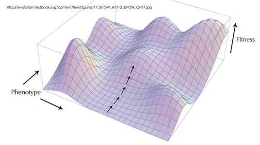
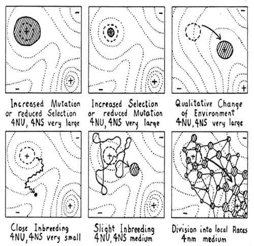
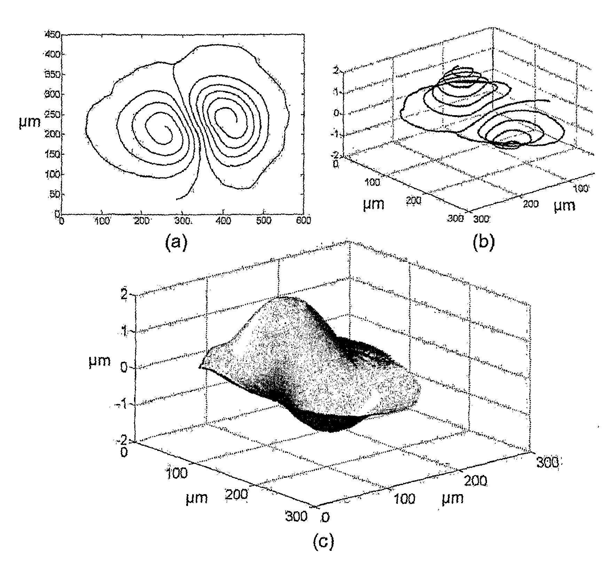
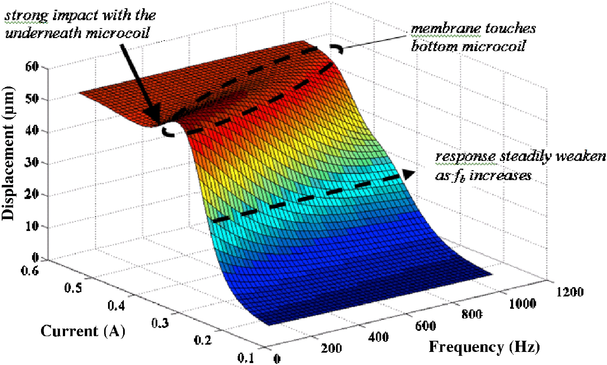
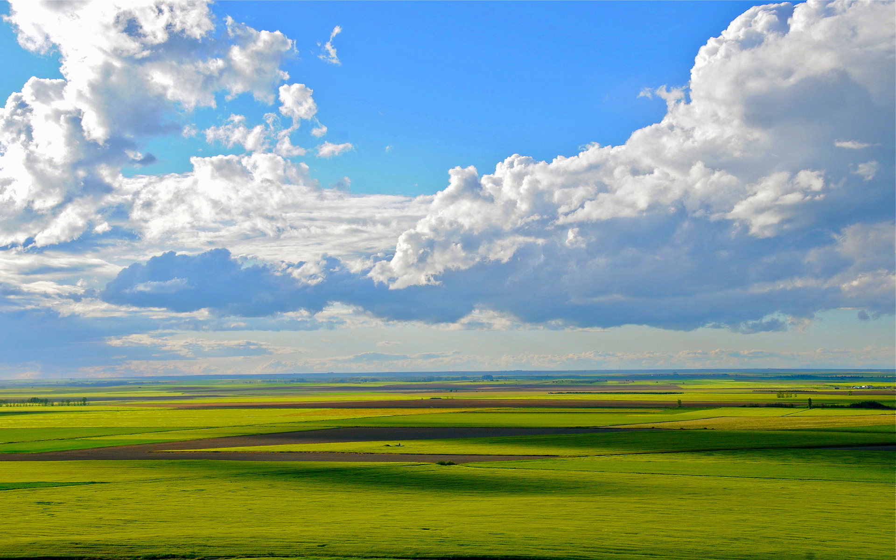
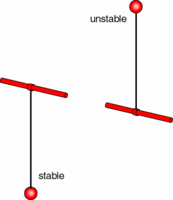
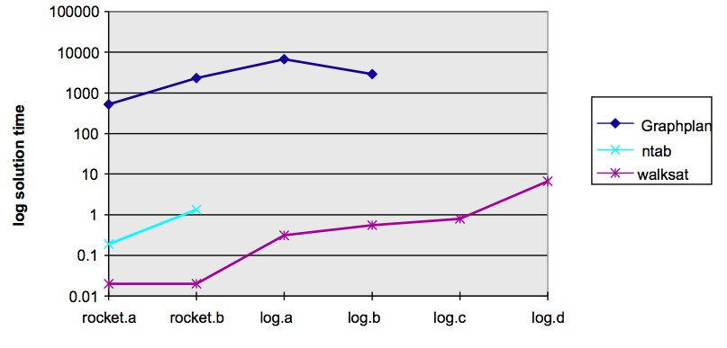

   
[At a glance...](https://github.com/txt/mase/blob/master/OVERVIEW.md) |
[Syllabus](https://github.com/txt/mase/blob/master/SYLLABUS.md) |
[Models](https://github.com/txt/mase/blob/master/MODELS.md) |
[Code](https://github.com/txt/mase/tree/master/src) |
[Lecturer](http://menzies.us) 

# MaxWalkSat

[MaxWalkSat][kautz96] is a non-parametric stochastic  method for sampling the _landscape_
of the local region. Historically speaking, _MaxWalkSat_ was a very impactful
algorithm. But, at least here, the real purpose of discussing _MaxWalkSat_
is to introduce the idea of _landscapes_.
It will be argued that _more_ important than the algorithms is the _shape_
of the space they search. Since this shape can change, it is not possible to
prove the adequacy of these meta-heuristics _unless_ you first characterize
the space they are trying to explore. 

So before we talk about _MaxWalkSat_, we had better talk sone about _landscapes_.

[kautz96]: http://goo.gl/D8G9u8 "Henry Kautz and Bart Selman and Yueyen Jiang, A General Stochastic Approach to Solving Problems with Hard and Soft Constraints, The Satisfiability Problem: Theory and Applications, 1996, pp 573--586"

## The Suspicious Utility of Search

The concept of "search" is surprisingly general. It can be applied to
many applications. For example  here are some recent
applications of search-based studies, just by  me and my students, in the last few years:

+ In 2014: [learning better pilot strategies][krall14];
+ in 2013: [feature planning][sayyad13a];
+ In 2012: [test case generation][and12];
+ In 2010: [spacecraft re-entry optimization][gay10b];
+ In 2009: [software process planning][green09];
+ In 2007: [software tool selection][me07a];
* In 2002: [optimizing risk mitigation plans][re02]
for software requirements engineering (updated and heavily optimized [here][gay10]).
    + Pardon my hubris, but I have to say that this paper is just a little bit famous:
	  according to [Mark Harman][harn11],
	  it was one of the earliest papers to apply Pareto optimality in search-based software engineering (SBSE) for requirements engineering.

[krall14]: http://goo.gl/TGWeAzxs "J Krall, T Menzies, M Davies, Learning the Task Management Space of an Aircraft Approach Model, 2014 AAAI Spring Symposium Series."

[and12]:   http://goo.gl/rHvwe6 "James H. Andrews, Tim Menzies, Felix Chun Hang Li: Genetic Algorithms for Randomized Unit Testing. IEEE Trans. Software Eng. 37(1): 80-94 (2011)"

[sayyad13a]: http://goo.gl/Zr632Z "Abdel Salam Sayyad, Joseph Ingram, Tim Menzies, Hany Ammar: Scalable product line configuration: A straw to break the camel's back. ASE 2013: 465-474"

[green09]: http://menzies.us/pdf/09value.pdf "Phillip Green II, Tim Menzies, Steven Williams, and Oussama El-Rawas. 2009. Understanding the Value of Software Engineering Technologies. In Proceedings of the 2009 IEEE/ACM International Conference on Automated Software Engineering (ASE '09)."

[gay10b]: http://goo.gl/mj8k3x "Gregory Gay, Tim Menzies, Misty Davies, Karen Gundy-Burlet: Automatically finding the control variables for complex system behavior. Autom. Softw. Eng. 17(4): 439-468 (2010)"

[me07a]: http://menzies.us/pdf/07casease.pdf "Tim Menzies, Oussama El-Rawas, Jairus Hihn, Martin S. Feather, Raymond J. Madachy, Barry W. Boehm: The business case for automated software engineering. ASE 2007: 303-312"

[re02]: http://menzies.us/pdf/02re02.pdf "Martin S. Feather, Tim Menzies: Converging on the Optimal Attainment of Requirements. RE 2002: 263-272"

[gay10]: http://menzies.us/pdf/10keys.pdf "Gregory Gay, Tim Menzies, Omid Jalali, Gregory E. Mundy, Beau Gilkerson, Martin S. Feather, James D. Kiper: Finding robust solutions in requirements models. Autom. Softw. Eng. 17(1): 87-116 (2010)"

[harn11]: http://goo.gl/VSil2n "Mark Harman with Juan J. Durillo, Yuanyuan Zhang, Enrique Alba, and Antonio J. Nebro. A study of the bi-objective next release problem. Empirical Softw. Engg., pages 29-60, February 2011."

This a wide range of application areas- so much so that it really begs the question "why is
search so useful"?

## The Lay of the Land

The real story is that underneath surface features of all these problems is a common mathematical structure called, you guessed it, the landscape.

To know the landscape is to know how to optimize,
how to 
avoid getting  stuck on being over-adapted (hence overspecialized) on some local peak, when as [Stewart Brand][brand] so aptly puts it...

+ "Whole mountain ranges of opportunity could be glimpsed in the distance, but getting to them involved venturing 'downhill' into regions of lower fitness".

[brand]: http://edge.org/response-detail/11843 "Stewart Brand, Fitness Landscapes, Edge.org"

Studying such landscapes made Brand distrust claims
for "optimality" since what you call "optimum" may
actually be just a stepping zone to a better place.

Brand's favorite landscape comes from a 1932
genetics paper that discusses how different breeding
strategies respond well (or badly) to environmental
pressures.  In the following, the x-y axis might be
"length of hair" and "body weight" and the z-axis
might "probability of winning a fight".

[wright]: http://goo.gl/Zn40bQ "Sewall Wright, The Role of Mutation, Inbreeding, Crossbreeding, and Selection in Evolution, Sixth International Congress of Genetics, Brooklyn, NY: Brooklyn Botanical Garden, 1932."

Says Brand:

+ "The first two illustrate how low selection pressure
or a high rate of mutation (which comes with small
populations) can broaden the range of a species
whereas intense selection pressure or a low mutation
rate can severely limit a species to the very peak
of local fitness. The third diagram shows what
happens when the landscape itself shifts, and the
population has to evolve to shift with it."

+ "The bottom row explores how small populations
respond to inbreeding by wandering
ineffectively. The best mode of exploration Wright
deemed the final diagram, showing how a species can
divide into an array of races that interact with one
another. That jostling crowd explores well, and it
can respond to opportunity."

## Holes, poles, saddles, local minima, flat, brittle

So to understand search, understand the landscape.
If you know the landscape, you can see  where it can trap and where it can help us out. One such trap is the _saddle_
which, in the above diagram is the flat space between the mountain (called a _pole_) and the _hole_ next to it.

 Note that if walk along the saddle, you might think you
are in a stable space of solutions. But be warned, one slip to the left or right and the landscape changes dramatically. In the above
space you might fall into a hole or a pole.

Another  trap is the _local minima_ that _seems_ like a good idea but
if you get sucked into it, you may never find the much better place:

Another bad landscape is one that is completely flat. Try as you like, you walk along way around this one before finding anything better or worse:

The opposite of flat is _bumpy_:

Bumpy landscapes are common so
 [Harman][harm07] comments that understanding the neighborhood of our solutions is an open and pressing issue in search-based software engineering (SBSE):
 
+ "In some software engineering applications, solution robustness may be as im-portant as solution functionality. For example, it may be better to locate an area of the search space that is rich in fit solutions, rather than identifying an even better solution that is surrounded by a set of far less fit solutions."
+ "Hitherto, research on SBSE has tended to focus on the production of the fittest possible results. However, many application areas require solutions in a search space that may be subject to change. This makes robustness a natural second order property to which the research community could and should turn its attention."

[harm07]: http://goo.gl/Obssma  "M. Harman. The current state and future of search based software engineering. In Future of Software Engineering, ICSE’07. 2007."

For an example of a solution that would alarm Harman, here is a pendulum with a red ball on the end. Would you care to live on this ball?
I think not.

Bumpy landscapes mean that, sometimes, to achieve better goals you may have to first
give up some of your current achievements. In the history of A.I. this is also
called _Sussmann's anomaly_- that sometimes the way to "better" is via "worse".
There are many ways to "jump over" these anomalies.   Sussman (and his supervisor, Marvin Minsky) believed that intelligence requires an exolicit list of exceptions or tricks
and that any plan for making things better had better be auditted
by a   "debugging" system. That is a _knowledge-full_ approach that
requires some analyst to supply descriptions of "when to jump around". 
Alternate _knowledge-less_ approaches are:

+ Stochastic jumps  using, say, [simulated annealing](sa);
+ The  _retries_ mechanism discussed below;
+ _Momentum_ constants added to the mutators of stocahstic search. Such
  momentum constants resist sudden stops to the search: if a local maximum
   is reached, the momentum constant would push the inference a little further
     just to see if anything better lies beyond the current position. For
      example, in the following landscape, momentum would nudge the ball
       over that little lip into a better (and lower) world.

Which is best: knowledge-full or knowledge-less? Well, that depends on the nature
of the problem, the intrinsic value of the knowledge, etc etc. But the
general engineering trade-off is that _knowledge-less_ approaches are faster
to build and maintain, while the _knowledge-full_  approaches perform
comparatively better. FYI- I used to work on _knowledge-full_ approaches but
I have found my life to be easier since I switched to _knowledge-less_.

## Learning the Landscape

Since landscapes are so important, they have been extensively studied. In the
case of systems of numeric equations, it is possible to infer the landscape
from the maths. For example, here are eight important kinds of landscapes:

The [Jacobian matrix](http://en.wikipedia.org/wiki/Jacobian_matrix_and_determinant) 
(the matrix of all first-order partial derivatives)
of these three-dimensional systems have 3 eigenvalues:

+  one of which must be  real 
+ and the other two can be either both real or complex-conjugate. 

Depending on the types and signs of the eigenvalues, there are a few interesting cases : 

* **Node** when all eigenvalues are real and have the same sign; The node is stable (unstable) when the eigenvalues are negative (positive);
* **Saddle**: when all eigenvalues are real and at least one of them is positive and at least one is negative; Saddles are always unstable;
* **Focus-Node**: when it has one real eigenvalue and a pair of complex-conjugate eigenvalues, and all eigenvalues have real parts of the same sign; The equilibrium is stable (unstable) when the sign is negative (positive);
* **Saddle-Focus**  when it has one real eigenvalue with the sign opposite to the sign of the real part of a pair of complex-conjugate eigenvalues; This type of equilibrium is always unstable.

This is all well and good- if you are studying a 3d continuous numeric system. However, there are many other kinds of systems. For example
the FORTRAN code used in [spacecraft re-entry optimization][gay10b] may be
100,000s lines of code with a multitide of discrete (e.g. boolean)
values as well as conditionals that divide the internal space into
many discontinuous regions (one for each if-else branch). For such more
complex systems, to learn the landscape, the best you can do is:

* Poke around a little; 
* When done, go back and do it all again to see if you end up in a 
  different place.
  
Enter MaxWalkSat.

## And Finally, MaxWalkSat

The above was a very _long_ introduction to a very simple idea:
when randomly searching a space by mutating
all dimensions,
sometimes fixate on improving things on
just one dimension. This is called _local search_.

In terms of landscapes,
it is like:

1. Jump all around the hills
2. Sometimes, sitting still while rolling marbles left and right
3.  Then taking one step along the direction where the marbles roll the furthest.
4.  Go to 1.

The code is remarkably simple- even simpler than simulated annealing. There is no notion of "cooling" or jumping to non-optimal
local solutions. Instead, at some probability _p_ just jump around. Then, at probability _(1-p)_, fixate on one variable
and try all its values in (say) increments of (max-min)/10 (and use the value that most improves the score function).

Note that there is an added idea: the _retry_. Sometimes, there is no point repainting the house if the foundations
are crumbling. So, occasionally, just go back to the beginning to reset and retry (I love retries- its such a lazy way to solve problems:
give up, forget everything, and start all over). In terms of landscapes, the idea is that good solutions are few and far between.
If you are not making good progress locally, you should not crawl around the local space- better to leap to somewhere else and
start over.

Here's the code for local search, adapted from [Kautz and Selman et al.'s MaxWalkSat][kautz96] system:

    FOR i = 1 to max-tries DO
      solution = random assignment
      FOR j =1 to max-changes DO
        IF  score(solution) > threshold
            THEN  RETURN solution
        FI
        c = random part of solution 
        IF    p < random()
        THEN  change a random setting in c
        ELSE  change setting in c that maximizes score(solution) 
        FI
    RETURN failure, best solution found

This is a very successful algorithm. Here's some
performance of WALKSAT (a simpler version of
MAXWALKSAT) against a complete search

Here's another example:  two AI algorithms
trying to solve the "latin's square" problem: i.e. pick an
initial pattern, then try to fill in the rest of the
square with no two colors on the same row or column.

<a href="https://raw.githubusercontent.com/wiki/timm/sbse14/etc/img/latin.mov">Latin Sqaure</a>

+ The deterministic method is the kind of exhaustive
theorem proving method used in the 1960s and 1970s
that convinced people that "AI can never work".
+ The stochastic method is a
local search which looks for a color to flip that
reduces the number of conflicts on each row or column.

This stochastic local search kills the latin squares
problem (and, incidently, many other problems).

## Finally

So the important idea here is not simulated annealing or MaxWalkSat or whatever other algorithm you'd care to name. The real thing
to understand is _landscapes_ and how we can walk around it, faster. Happy trails campers!

_________

Copyright © 2015 [Tim Menzies](http://menzies.us).
This is free and unencumbered software released into the public domain.   
For more details, see the [license](https://github.com/txt/mase/blob/master/LICENSE).

