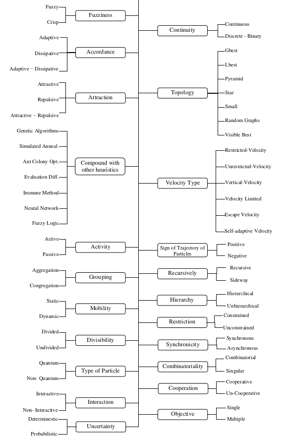

   
[At a glance...](https://github.com/txt/mase/blob/master/OVERVIEW.md) |
[Syllabus](https://github.com/txt/mase/blob/master/SYLLABUS.md) |
[Models](https://github.com/txt/mase/blob/master/MODELS.md) |
[Code](https://github.com/txt/mase/tree/master/src) |
[Lecturer](http://menzies.us) 

# PSO= Particle Swarm Optimization

## Fish gotta Swim, Birds Gotta Fly

If ever you want to relax a little and reflect on the glories of nature,
consider how tiny little birds called  starling self-organize into fantastic patterns
(called _murmurations_):

[[img/starlings.png]]

See the [fantastic videos of starling murmurations](https://www.youtube.com/watch?v=iRNqhi2ka9k).

So, how can flocks form into fantatsic patterns?

+ Firstly, they flock for survival. In a flock, every bird strives to avoid the edge where adept predators can sometimes snatch a victim. And starling flocks can be very big (10,000 to 100,000s). Which means that such flocks have emergent properties...
+ Secondly, the patterns in starling flocks come
from [the mathematics of close flocking](http://www.fastcoexist.com/3033351/the-beautiful-phenomena-of-starling-flocks-explained-by-computers)
   + Rule1: Each starling does whatever its neighbor is doing.
   + Rule2: A starling must maintain a certain pattern of light and dark
     in its field of vision.
        + If you think of a murmuration as a giant
          cloud of starlings, each bird won't want to
          move to the densest, darkest
          part--otherwise, looking out from within
          the cloud would become impossible.
        + Similarly, birds won't want to go to the
          lightest bits, characterized by sky, or
          they'll detach from the flock entirely.	 
   + Rule3: add in some stochastic jiggle. 

In any case, the general lesson here is that distributed
flocks of things (birds or ideas)
can achieve surprising results...

## So What is PSO?

_From Wikipedia:_

In computer science, particle swarm
optimization (PSO) is a computational method that
optimizes a problem by iteratively trying to improve
a candidate solution with regard to a given measure
of quality. 

PSO optimizes a problem by having a
population of candidate solutions, here dubbed
particles, and moving these particles around in the
search-space according to simple mathematical
formulae over the particle's position and
velocity. 

Each particle's movement is influenced by
its local best known position but, is also guided
toward the best known positions in the search-space,
which are updated as better positions are found by
other particles. 

This is expected to move the swarm
toward the best solutions.

PSO is a metaheuristic as it makes few or no
assumptions about the problem being optimized and
can search very large spaces of candidate
solutions. 

However, metaheuristics such as PSO do
not guarantee an optimal solution is ever
found. 

More specifically, PSO does not use the
gradient of the problem being optimized, which means
PSO does not require that the optimization problem
be differentiable as is required by classic
optimization methods such as gradient descent and
quasi-newton methods. 

PSO can therefore also be used
on optimization problems that are partially
irregular, noisy, change over time, etc.

The theory on which PSO is found is _sociocognition_,
which states that social cognition happens in the interactions
among individuals in sch a manner that
each individual learns from its neighbors' models/patterns,
especially from those learning experiences that are rewarded.
In this approach:

+ _Cognition emerges from the convergence of individual's beliefs._

PSO is also biologically inspired, drawing on the observation
that any member of a swarm will try to move as close to the center
of the swarm as possible because an individual on the edge 
of the swarm is more likely to be caught by a predator.

A basic variant of the PSO algorithm works by:

+ having
a population (called a swarm) of candidate solutions
(called particles). 
+ These particles are moved around
in the search-space according to a few simple
formulae. 
+ The movements of the particles are guided
by their own best known position in the search-space
as well as the entire swarm's best known
position. 
+ When improved positions are being
discovered these will then come to guide the
movements of the swarm. 
+ The process is repeated and
by doing so it is hoped, but not guaranteed, that a
satisfactory solution will eventually be discovered.

## Inside PSO

The internals of a basic PSO are, well, pretty basic (but
see [this paper](https://github.com/timm/sbse14/wiki/etc/pdf/09reviewPSO.pdf)
for a long list of exciting variants to this form).

### Visually

New velocity = old velocity plus a pull towards my best plus a pull towards everyone'es best.

[[img/psoAdd.png]]

### The Details

+ Generate _N_ particles at some random position 
     + _N[i] = (p1,p2,p3,p4,...)_
	 + Each particle "_i_" ...
	     + Has velocities for each parameter:
		      + _V[i] = (v1,v2,v3,v4,...)_
		 + Keeps a memory of its best seen so far:
		      + _B[i] = (p1,p2,p3,p4,...)_
	     + Knows of a local best particle (best for all its neighbors):
		      + _L[i] = (p1,p2,p3,p4,...)_
         + Note that, syntactically, _N,B,L_ have the same form. So one data
		   structure should do for all three/=.

Repeat till happy or bored:

+ Evaluate fitness of _N[i]_.
    + Maybe, update personnel best _B[i]_ or _L[i]_ if _N[i]_ better than old. 
+ Update velocity:
    + _V = K\*(w\*V + &phi;1\*rand(B - P) + &phi;2\*rand(L - P))_
	+ &phi;1 is the _social learning rate_ (how much
	  you learn from other people).
	+ &phi;2 is the _cognitive learning rate_
	  (how much you learn from yourself).
+ Update position:
    + _N = N + V_
    + If _N_ or _V_ grows outside of _N_'s 
	  (min,max) range for that variable,  set _V_ to 
	  the nearest of (min,max)-- but see below.

Note that:

+ Plus and minus and multiply run over all parameters in the particle;
+ "_K_" is the _construction factor_:
      + _K = 2 / ( abs(2 - &phi; - sqrt(&phi; \* &phi;) - 4&phi;))_  
      + _&phi; = &phi;1 + &phi;2_ 
	  + &phi; > 4.

### Details

Usually. 30 particles is small
enough to be efficient, yet large enough to
produce reliable results.

Another standard is
    _&phi;1 =  &phi;2 = 2.05_ but 
	    [some research](https://github.com/timm/sbse14/wiki/etc/pdf/Off-The-Shelf_PSO.pdf)
	    argues that you should listen to yourself about twice
		as much as the crowd; i.e. 
		&phi;1 = 2.8;  &phi;2 = 1.3
		
As to what is "local neighborhood", often we just
use  "all" (so finding the
	    local best takes constant time- just track note the  best
		ever seen so far and use that when _L_ is required). 
		 [Some research](https://github.com/timm/sbse14/wiki/etc/pdf/Off-The-Shelf_PSO.pdf)
		results suggest that this global neighborhood
appears to be a better general choice, as it
seems to require less work for the same
results.
     
As to when to udpate "best", one solution is to
	   move all particles before updating "best". Another
	   is to explore them in a random order, updating "best"
	   if we ever find a better one. [This latter approach
	   can be less costly](https://github.com/timm/sbse14/wiki/etc/pdf/Off-The-Shelf_PSO.pdf).

If we choose not to enforce _Nmax_ or _Vmax_,
particles are free to fly as far and as fast a
possible. Is this a good thing?

[Some research](https://github.com/timm/sbse14/wiki/etc/pdf/Off-The-Shelf_PSO.pdf)
reports that reducing _Vmax_ from a very large value
to _Vmax=Nmax_ can significantly improved PSO
performance.  As we reduce _Vmax_, so do we reduce
the pressure exerted by the particle's velocity,
allowing the particle's memory of its best location
and that of the neighborhood best to pull the
particle back into the search region.

On the other hand, the constriction factor _K_
should act as a damper to escalating velocities,
presumably negating the need for any _Vmax_
variable.

As commented by 
[some researchers](https://github.com/timm/sbse14/wiki/etc/pdf/Off-The-Shelf_PSO.pdf)
an alternative is to try to fine tuning _Vmax_, we
considered 'unpinning' a particle at _Xmax_ by
resetting its velocity to zero. In that way, the
pull of the particle’s best location memory and that
of the neighborhood best immediately begins drawing
the particle back into the search space.

## Readings

+ Excellent experimental paper
  **Scatter PSO - A more effective form of Particle Swarm 
  Optimization**; see
  [link](https://github.com/timm/sbse14/wiki/etc/pdf/07psoScatter.pdf)
+ Advice on designing PSO: recommendations for good
  [magic settings](https://github.com/timm/sbse14/wiki/etc/pdf/Off-The-Shelf_PSO.pdf).
  This article is also a good example of
		     some team exploring MOEA parameter
		     settings in a clear and logical manner.
+ PSOs are an excellent basis for long-term research since
  simple enough to prompt and encourage 
  [wide-scale experimentation with their basic 
  form](https://github.com/timm/sbse14/wiki/etc/pdf/09reviewPSO.pdf).

_________

Copyright © 2015 [Tim Menzies](http://menzies.us).
This is free and unencumbered software released into the public domain.   
For more details, see the [license](https://github.com/txt/mase/blob/master/LICENSE.md).

