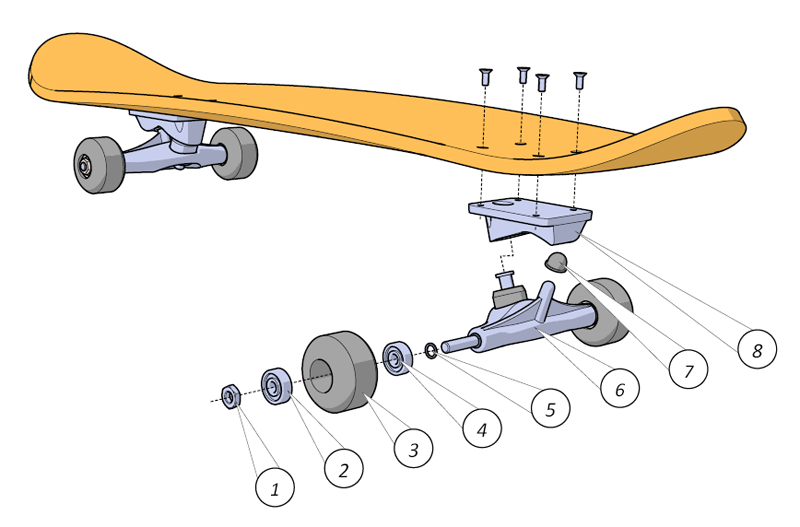
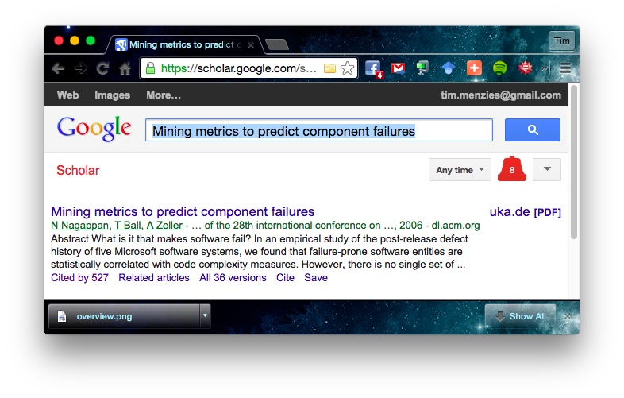
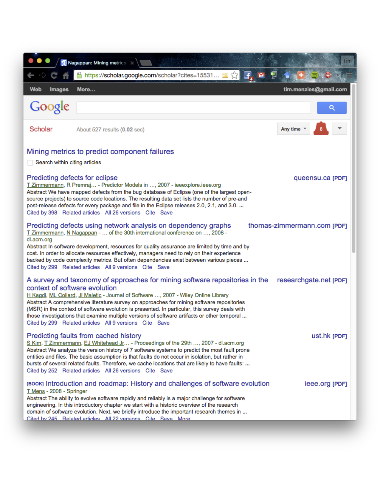

   
[At a glance...](https://github.com/txt/mase/blob/master/OVERVIEW.md) |
[Syllabus](https://github.com/txt/mase/blob/master/SYLLABUS.md) |
[Models](https://github.com/txt/mase/blob/master/MODELS.md) |
[Code](https://github.com/txt/mase/tree/master/src) |
[Lecturer](http://menzies.us) 

# Read123456789: reading research papers

As technologies change, technologists need to
continually update their technical knowledge.
The problem with that is that reading all the latest research is very hard.
Working through complex technical papers is a complex and technical task.
For example, if you ask new graduate students to read ten papers in a particular sub-field:

+ It can take a full day to read the first paper.
+ But after reading ten papers, they can do it much faster.

Since reading is so important, the rest of this page offers

+ Notes on [how to read papers, faster](#how-to-read-papers-faster)
+ A [reading assignment](#exercises-in-reading-faster) that lets students practice their skills.
    + For a _fast-path_ assignment for newbies, lecturers could assign parts [one](#part1-learn-historical-context)
      and [two](#part2-identify-reusable-data) of
      that assignment, over a 2-3 week period.
	+ For a more _advanced_ assignment, lecturers could assign parts
	  [one](#part1-learn-historical-context) and [two](#part2-identify-reusable-data)
	  and [three](#part3-track-advances) and [four](#part4-one-big-essay), 
	  spread over a one semester (one paper per week, essay at end-of-semester)

____

## How to Read Papers, Faster

There are four keys to reading papers faster:

+ _Rhetorical Strategies_ : Understanding the rhetorical strategies
taken by the authors.
+ _Terminology:_ Having a working background knowledge of the half-dozen key terms in a paper.
+ _Context:_ Experts can read papers faster when they know of other work in the field and can place this new
paper into the context of other work. 
+ _Feature extraction:_  Experts are experts at anything since they know what to look for, and what can be skipped over. This is true for many tasks, including reading:
    + Experts do not read entire papers, word for word.
    + Rather, they hunt and peek looking for [certain key features](READINGrubric.md).

### Feature extraction, details

To put that last point another way,  papers are not read for _repeatability_ (of the whole paper) but for _reusability_ of their parts. 
Technical papers are really a
  presentation of [many connected technical concepts](READINGrubric.md),
some of which the reader will extract and apply to their own work.
So  we should not read papers so we can paint them again as beautiful complete works of art.
Rather, we should treat them as a design of some complex product...

+ Which can be exploded into [various parts](READINGrubric.md)...
+ ... any of which might be repurposed in other areas.

To put that another way, we should not _read_ papers but we should _survey_ them, to

+ Map out their [internal structure](READINGrubric.md)
+ To find and extract whatever [parts](READINGrubric.md) might be useful to use.

Of course, once we find the (little) bits that we really want to use, then we might spend hours/days struggling
to understand those (small) parts. But otherwise, we need to read _over_ papers, not _through_ them. 

### Rhetorical Strategies: details

#### Parts of a Paper

_The following notes on "parts of a paper"  are taken from the [excellent notes by Tim Sheard and Todd Leen](http://web.cecs.pdx.edu/~sheard/course/SkolSkillsW06/LectureNotes/l02Read.ppt)._

When reading a paper, take care to note:

+ The thesis being investigated 
+ The contribution 
+ The method of investigation 
+ The “power” of the results
+ The applicability of the results 
+ Summary of the technical development 
+ Details of any examples 

In a _first pass_ of a paper, skim over

+ The abstract, 
(to determine relevance
to determine kind of paper)
+ Pictures
tables, graphs, and diagrams
concepts (just to get the big picture)
+ References (do you recognize them?)

### Swales' Three-Move Model

_The following notes on "Swales' Three-Move Model" are taken from the [excellent notes by James Luberda](http://www.sp.uconn.edu/~jbl00001/swales_cars_introductions_model.htm)._

The following is based upon an empirically-derived
model of how “real-world” research article
introductions commonly proceed:

+ Note that it is not
a set of rules, but rather something of a guide as
to what readers of research articles and academic
essays are likely to expect (and find), a set of
patterns in introductions that facilitate their
reading and comprehension.
+ You might think of each
“move” below as a kind of verbal action—a “move” a
writer will make to have a particular effect on the
reader. 
 
Move 1    Establishing a territory

- In this opening move, the writer may do one or more of the following to broadly sketch out where the  subject of his/her essay falls—the “big picture”
  - Point out the importance of the general subject
  - Make generalizations about the subject
  - Review items of previous research

Move 2    Establishing a niche

- In this move, the writer then indicates to the reader the particular area of the broader subject that the essay will deal with. This can be done using one or more of the following:
  -   Make a counter-claim, i.e. assert something contrary to expectations
  - Indicate a gap in the existing research/thinking
  -  Raise a question about existing research/thinking
  -  Suggest the essay is continuing a tradition, i.e. it is following in the footsteps of previous research/thinking

Move 3    Occupying the niche

- In this move, the writer then sketches out exactly what this particular essay will accomplish in relation to move2, and gives the reader a sense of how the essay will proceed. In general, each of the steps below will appear in this move, in order:
  - Step 1: Outline the purpose of the essay, or state the research that was pursued
  - Step 2: State the principal findings of the essay—what the reader can expect the essay/research will have accomplished for them by the time they get to the end
  - Step 3: Indicate, roughly, the structure of the essay—what will appear in it and in what order

____

## Exercises In Reading Faster

Note that, at first, it will take _hours_ to read one paper. However, after a couple your reading will speed
up dramatically. So do not be discouraged if, at first, this is ridiculously slow.

### Part1: Learn Historical Context

In the following, anything shown _in italics_ is explained below.

+ One: Find a highly cited paper from the automated software engineering literature
     + Find some source of highly cited papers
       + For students of general software engineering, start with the [International Conference on Software Engineering](https://goo.gl/1bfKUG)
	   + For students of automated software engineering,  start with the [International Conference on Automated SE](https://goo.gl/HqOVJ1)
     + Pick any 2011 paper and _summarize some of its parts_.
+ Two,Three,Four,Five: Explore context,  backwards
     + Find four papers in the One's reference list
          + That date 2008 to 2010
	      + That are _highest cited_ (Note that recent papers have less cites than older papers).
	  + Walk them backwards in time,  _summarizing some of their parts_

Notes:

+ By _summarize parts_ we mean write 500 to 1000 words  on text:
    + Starting with  a clear reference to the paper
    + Write down the four most important keywords in the paper, plus a two line definition of each.
    + Offer very brief notes on any half dozen of the items listed  [here](READINGrubric.md).
    + For Two,Three,Four, etc also comment on the connection to the other papers.
    + Do you know how long 1000 words is? About as long as this page. So you
	want to write something half this size.
	+ You goal is being able to generate such a summary in thirty minutes:
	    + It is unlikely you will reach this goal  until _after_ you have read numerous papers.
+ To find _highest cited papers_, look up items from the reference list in the week1 paper paper in scholar.google.com (or dl.acm.org/ or
  ieeexplore.ieee.org) and count their citations.  For example, looking up
  "Mining metrics to predict component failures" in scholar.google.com produces: 
   
  Looking bottom, you can see _Cited by 527_. If you click there, you find many others published since the first paper: 
   
  Google scholar sorts these top-to-bottom most-to-least cited (so the most cited papers are shown at top). So,
+ To find the _highest cited papers_ that cite the week1 paper, look up your week1 paper in scholar.google.com (or dl.acm.org/ or
  ieeexplore.ieee.org) and count their citations.

### Part2: Identify reusable data

+ Six: For any paper in the above sequence, _report any reusable data_.

Notes:

+ To _report any reusable data_, try to fill in the form [here](http://openscience.us/repo/contribute/donate). Hand in either:
      - A page shown what you entered from those fields
       - Or an explanation why your kind of papers do not generated data of the kind that can be entered here.

### Part3: Track advances.

+ Seven,Eight,Nine: Explore context, forwards
      + Find three papers that cite the One paper
          + That date 2012 to 2015
	      + That are _highly cited_ (Note that recent papers have less cites than older papers)..
      + Walk them forwards in time,  _summarizing some of their parts_
	  
	  
### Part4 (one big essay)

Take all the above and summarize the procession of research 2008 to 2015 of some automated software
engineering issue.

+ 10 pages, 2 columns,  using the Word or Latex formats shown in [this page](https://www.acm.org/sigs/publications/proceedings-templates).
+ Include at least 20 references, eight of which you studied above while the others are related work (or, indeed, far flung work that you think _should_ be connected to your eight but , so far, no one has done so).
+ Mention as many as possible of items listed [here]READINGrubric.md).

Note that, for this essay, the keyword definitions you generated above will become the core of your related work section.

For full marks:

+ Through out your text,
       comment on how eight of these nine papers improved (failed to improve, ignored, extended, refined) the issues
       mentioned in an early paper.
+ End with your own recommendations of the path from here. Mention the issues that are now retired, that no one has retired,
	     that someone should retire, or that no one should even try to retire.

Note: if the  papers you studied above proved to be dull, fell free to start again with some other 2011 paper from
[here](https://goo.gl/HqOVJ1). Note that, by the time you get to Part4, it will take you less than a day to work through eight papers (it may even just take you one afternoon).

_________

Copyright © 2015 [Tim Menzies](http://menzies.us).
This is free and unencumbered software released into the public domain.   
For more details, see the [license](https://github.com/txt/mase/blob/master/LICENSE.md).

