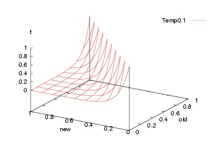

[](https://github.com/txt/mase/blob/master/README.md)   
[TOC](https://github.com/txt/mase/blob/master/TOC.md) |
[At a glance...](https://github.com/txt/mase/blob/master/OVERVIEW.md) |
[Syllabus](https://github.com/txt/mase/blob/master/SYLLABUS.md) |
[Models](https://github.com/txt/mase/blob/master/MODELS.md) |
[Code](https://github.com/txt/mase/tree/master/src) |
[Lecturer](http://menzies.us) 


# Simulated Annealing 101

Our task in this subject is to walk over decades of work, understanding
the successes and limitations of various tools.

For model-based SBSE, lets start at the very beginning... with simulated
annealing.

## Overview


Search is a universal problem solving mechanism in AI. The sequence of
steps required to solve a problem is not known a priori and it must be
determined by a search exploration of alternatives.


It is useful to distinguish two kinds of search:

+ _Ordered-search_; e.g. the tree and graph searchers discussed
  below. In this kind of search, the solutions spreads out in a wave
  over over some solution space.
+ _Unordered-search_ where a partial solution is quickly (?randomly)
  generated, then maybe fiddled with. A common unordered search method
  is to generate a number of slots, each with random values as done in
  PSO or simulated annealing or MAXWALKSAT (discussed below).  
  
Ordered
  search is useful for problems with some inherent ordering (e.g.)
  walking a maze. That is, ordered search is 
  useful for problems where decisions _now_
effects _future_ choices; e.g. when playing a game, i.e.
what happens at move "_i+1_" is determined by move "_i_".


For ordered search, see any AI textbook.
Much of this subject is concerned with unordered search. 
Unordered search is useful for problems where ordering does not
matter. For example, if a simulator accepts N inputs, then an
unordered search might supply M ≤ N inputs and the rest are filled in
at random.

### Stochastic Search


Unordered search is often explored by some
kind of stochastic search.
Rather than struggle with lots of tricky decisions,

+ exploit speed of modern CPUs, CPU farms.
+ try lots of possibilities, very quickly

For example:

+ current := a random solution across the space
+ If its better than anything seen so far, then best := current

Stochastic search: randomly fiddle with current solution

+ Change part of the current solution at random

Local search: . replace random stabs with a little tinkering

+ Change that part of the solution that most improves score

Some algorithms just do stochastic search (e.g. simulated annealing) while others do both (MAXWALKSAT, ISSAMP)

+ 1950s: Simulated annealling
+ 1960s: Genetic algorithms
+ 1991: ISSAMP
+ 1992: WALKSAT
+ 1997: Differential evolution
+ 2000+: Multi-objective evolutionary algorithms

## Simulated Annealing

From: S. Kirkpatrick and C. D. Gelatt and
M. P. Vecchi Optimization by Simulated Annealing,
Science, Number 4598, 13 May 1983, volume 220, 4598,
pages 671680,1983.


If we just do a _greedy search_ (i.e. find the next best nearby thing and jump to it)
then that search can get trapped and tricked by ideas that are locally promising but
not globally optimal:


Q: What to do?

+ A: Add in some jiggle. 

But do not go crazy. As the run goes on, jiggle less and less (so start off jiggling and, over time, become more greedy).

Enter simulated annealling.
In the 1950s, when computer RAM was very small, this was a a standard technique for solving
non-linear problems. 
SA generates _new_ solutions by randomly perturbing (a.k.a. “mutating”) some part of an _old_ solution. _New_ replaces
_old_ if

+  It scores higher; 
+ or (b) It reaches some probability set by a “temperature” constant. 

Initially,this  temperature is high so SA jumps to sub-optimal solutions (this allows the algorithm to escape from locally bad ideas). 

Subsequently, the “temperature” cools and SA only
ever moves to better new solutions.  

From [Henderson et al. ][hen03]:

+ Simulated annealing is so named because of its analogy to the process of physical
annealing with solids, in which a crystalline solid is heated and then allowed to cool
very slowly until it achieves its most regular possible crystal lattice configuration (i.e., its
minimum lattice energy state), and thus is free of crystal defects. 
+ If the cooling schedule
is sufficiently slow, the final configuration results in a solid with such superior structural
integrity. 
+ Simulated annealing establishes the connection between this type of thermo-
dynamic behavior and the search for global minima for a discrete optimization problem.
+ Furthermore, it provides an algorithmic means for exploiting such a connection.

[hen03]: http://link.springer.com/chapter/10.1007%2F0-306-48056-5_10 "Darrall Henderson, Sheldon H. Jacobson, Alan W. Johnson. 'The Theory and Practice of Simulated Annealing', Handbook of Metaheuristics, International Series in Operations Research & Management Science Volume 57, 2003, pp 287-319"


## Code

SA is often
used in SBSE, perhaps due to its simplicity. Here's
the whole code:

+ Let _k_ be some temperature constant that is varied 1 to _kmax_ 
      + So _k / kmax_ is some number 0..1 representing the 
        extent of the current search.
+ Let _s_ be a _solution_ (a list of numbers) with energy _e_.
+ Let _sn_ be the next solution with energy _en_.
+ Let _sb_, _se_ be best solution and energy yet found.
+ Let _emax_ be "enough" energy. Usually, max possible minus
  some _epsilon_ vale.

Code:

    s := s0; e := E(s)                  // Initial state, energy.
    sb := s; eb := e                    // Initial "best" solution
    k := 0                              // Energy evaluation count.
    WHILE k < kmax and e > emax         // While time remains & not good enough:
      sn := neighbor(s)                 //   Pick some neighbor.
      en := E(sn)                       //   Compute its energy.
      IF    en < eb                     //   Is this a new best?
      THEN  sb := sn; eb := en          //     Yes, save it.
	        print "!"
      FI
	  IF    en < e                      // Should we jump to better?
	  THEN  s := sn; e := en            //    Yes!
	        print "+"                        
      FI
      ELSE IF P(e, en, k/kmax) > rand() // Should we jump to worse?
      THEN  s := sn; e := en            //    Yes, change state.
	        print "?"
      FI
	  print "."
      k := k + 1                        //   One more evaluation done    
      if k % 50 == 0: print "\n",sb
    RETURN sb                           // Return the best solution found.

Note the space requirements for SA: only enough RAM
to hold 3 solutions. Very good for old fashioned
machines.

Note the print statements shown above:

+ One new line ever 50 steps;
     + At the start of each new line, print current best energy
+ Print "!" if we get to somewhere better globally; 
+ Print "+" if we get to somewhere better locally;
+ Print "?" if we are jumping to something sub-optimal;

So, for a model with one input _x_ and two output goals _f1,f2_, the run looks like this.
Note that
each line is a report after k=50 new steps into the simulated annealling.


````
51 ..!+.?.+..?.+..!+.?.+.?.!+..?.+.?..?..?...+.?.?.+.+...?.+..+.......?...+....+..
99 ....+.+.....?.+..+....?...!+..........?.+......+..........?..+.+
99 .....?..+...+..+......+......+..........?.+...+.........!+...
99 ...!+..?.+..........+.......?....+...+.......+......?.+......
99 ........?......+.......+.....?.+.+.........?.+...+..+.......
99 ........?....+.....+.?..+.+..?...+.........+...+............
99 ....+.......?....+..+....?.+.....+......?.+..+....+..+........
99 .........+..............?.+..+........................
99 ....+.......................?..+.+.+.....+..............
99 ...?.+.+...........!+...............?.+.+..........+.......
99 ......+..................+..................+......+..
99 ....................?...+.+..+........................
99 ........?.+..+.............+.................?..+.......
99 ...+...............................................
99 ...............................................?.+..
99 .+................+.................................
99 .!+.................................................
99 ...........................?.?.+......+...............
99 ..................................................
99 ..................................................
````

Note that there are less _"?"_ marks (crazy jumps) later in the run than earlier.
This is the result of the _cooling schedule_ adjusting the temperature.

Note also that it _looks_ like we are wasting our time after the first 50 evaluations.
But as shown below, that is the fault of the summary variable we are using for energy.
It turns out that important things are happening even into the 8th and 12th line (500
to 600 evaluations).

Over that run, out two goals changed as follows.
As before, each line is a report after k=50 new steps into the simulated annealling.
Note how, initially, the median values and variances are very
very large. But after a few lines, we get down to very low values
and very low variances.

(Btw, to read the following, _"*"_ is the median 50% value;
the upper and lower quintiles are shown as _"-"_ left and right;
and the other quintiles are shown as white space.)

<f1

````
                            10%  30%   50%   70%   90%
						    ==========================
   *      --|---------   ,  32,  159, 1558, 4128, 9052
 * ---------|---         ,   5,  100,  515, 1332, 6622
 * ---------|----        ,   3,  239,  467, 1255, 7075
*-          |            ,   2,    2,    2,  167,  874
*--         |            ,  18,   18,   18,  647, 1569
 *          |            ,  18,   48,  427,  427,  586
  *--       |            ,  65,  170, 1087, 1087, 2168
*           |            ,  18,   50,   50,   50,   50
*           |            ,   8,   18,   18,   18,   18
*           |            ,   8,    8,   53,   53,  302
*           |            ,  16,   16,   16,   40,   53
*           |            ,   6,    6,    6,   65,   65
*           |            ,   0,   65,   65,   65,  114
*           |            ,   0,    0,    0,    0,    0
 *          |            ,   0,   35,  635,  635,  791
*           |            ,  20,   33,   73,  405,  592
*           |            ,   1,    1,    1,    1,  351
*           |            ,   1,  126,  126,  126,  501
*           |            ,   8,    8,    8,    8,    8
*           |            ,   0,    0,    1,    8,    8
````

<f2

````
                            10%  30%   50%   70%   90%
						    ==========================
    *     --|---------   ,  14,  214, 1720, 4389, 9437
 * ---------|---         ,   0,   64,  610, 1482, 6952
 *----------|---         ,  14,  181,  558, 1118, 6743
*-          |            ,   1,    1,    1,  222,  996
*--         |            ,   5,    5,    5,  753, 1415
*           |            ,   5,   80,  349,  349,  493
  *--       |            ,  37,  226,  959,  959, 2359
*           |            ,  25,   25,   25,   39,   39
*           |            ,   1,   39,   39,   39,   39
*           |            ,   1,    1,   28,   28,  237
*           |            ,  19,   28,   36,   36,   36
*           |            ,  20,   20,   20,  102,  102
*           |            ,   4,  102,  102,  102,  161
*           |            ,   4,    4,    4,    4,    4
 *          |            ,   4,   63,  538,  538,  683
*           |            ,   6,   14,   43,  490,  593
*           |            ,   1,    1,    1,    1,  430
*           |            ,   1,   85,   85,   95,  415
*           |            ,   1,    1,    1,    1,    1
*           |            ,   1,    1,    1,    3,    3
````

So one lesson from the above- it is not be enough to judge an
optimizer just by the average performance. Note in the above
that the variance is also an important factor, as is the upper bound (worst case
performance) that may take some time to tame.

## Details: What Probability Function?

But what to us for the probability function "P"? This is standard function:

    FUNCTION P(old,new,t) = e^(-1*(old-new)/t)

Which, incidentally, looks like this (note that the volume
where we might jump to a worse solution _shrinks_ as the temperature increases:

Initially  at k=0, (t=0):



Subsequently k=0.5*kmax (t=0.5):


Finally at k=kmax (t=1):


That is, we jump to a worse solution when "random() > P" in two cases:

+ The sensible case: if "new" is greater than "old"
+ The crazy case: earlier in the run (when "t" is small)

Note that such crazy jumps let us escape local minima.


_________

Copyright © 2015 [Tim Menzies](http://menzies.us).
This is free and unencumbered software released into the public domain.   
For more details, see the [license](https://github.com/txt/mase/blob/master/LICENSE).

