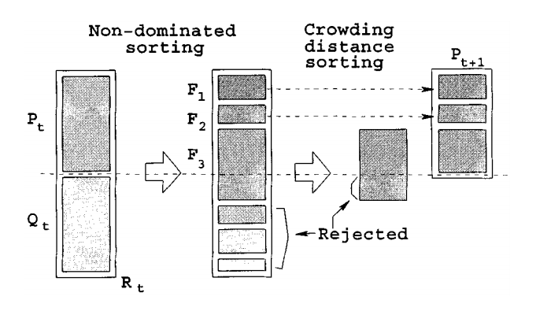
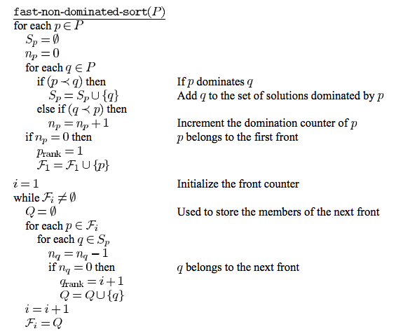
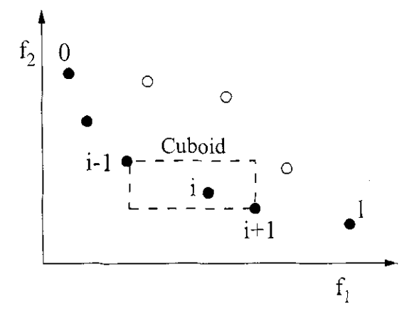

   
[At a glance...](https://github.com/txt/mase/blob/master/OVERVIEW.md) |
[Syllabus](https://github.com/txt/mase/blob/master/SYLLABUS.md) |
[Models](https://github.com/txt/mase/blob/master/MODELS.md) |
[Code](https://github.com/txt/mase/tree/master/src) |
[Lecturer](http://menzies.us) 

# NSGA-II

How to find cull many solutions, with multiple objectives

History: 1990s: NSGA, NPGA, MOGA

+ Sort according how often not dominated (nondominating sort)
+ Preserve diversity of solutions.
  + If a crowded part of the space, delete some
  + Elitism (to improve convergence)

All had some computation times.

NSGA-II (fast, approximate, non-dominating sort)

+ Divide candidates into _frontiers_:
+ For some small number:
  + Keep the top i-frontiers until we reach that number
  + If you fill up half way through a frontier,
  + Delete some using crowd-pruning

BUt how do you finds the bands? And what is crowd-pruning?

+ Patience. First, do you get the general idea?
+ Some fast primary ranking method to generate frontier1, frontier2, frontier3...
+ Keep frontier1, frontier2, frontier3... till frontieri gives you too many items
+ Sort frontieri by secondary ranking method, prune the lower ones

Primary rankings: sort by how many things you dominate:

+ Part one: find....
  + _np_: number of candidates that dominate _p_ (the upstream counter)
  + _Sp_: candidates dominated by _p_ (the downstream set)
  + _F1_: frontier 1 (the frontier of things dominated by no one) 
+ Part two...
   + For _P_ in frontier i
     + For everything _Q_ dominated by _P_
        + decrease the upstream counter by 1
	 + If upstream counter == 0
   	    + then _Q_ belongs in frontier i

Secondary ranking (only applied to the "too much"
frontier that cross "over the line").

Find an approximation to the cuboid space around around each
 candidate:

+ For each objective,
   + Sort the candidates on that objective
   + For each candidate _p_ in that "too much" frontier,
      + Find the _gap_ equal to the sum of the space
        _up_ and _down_ to the next candidate
      + Normalize _gap_  by the max-min in that objective.
      + Add _gap_ to _Ip_
+ Sort candidates by _Ip_
  + Discard the smaller ones. 

  

Officially faster. Strange to say, no runtimes in the famous
[NSGA-II paper](http://www.iitk.ac.in/kangal/Deb_NSGA-II.pdf)

_________

Copyright © 2015 [Tim Menzies](http://menzies.us).
This is free and unencumbered software released into the public domain.   
For more details, see the [license](https://github.com/txt/mase/blob/master/LICENSE.md).

