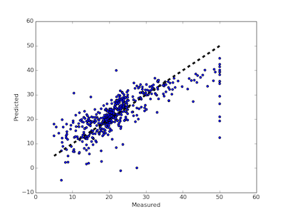

# Before we Begin

Our goals are lofty- introducing a new paradigm that combines data mining with multi-objective optimization.
And doing so in such a way that even novices can understand, use, and adapt these tools for a large range of
new tasks.

But before we can start all that, we have to handle some preliminaries.
All artists, and programmers, should start out as
apprentices. If we were painters and this was
Renaissance Italy, us apprentices would spend
decades study the ways of the masters, all the while
preparing the wooden panels for painting; agrinding
and mixing pigments; drawing preliminary sketches,
copying paintings, and casting sculptures. It was a
good system  that gave us the Michelangelo and Da
Vinci who, in turn, gave us the roof of the Sistine
Chapel and the Mona Lisa.

In terms of this book, us apprentices first have to become effective Python programmers.
The rest of this chapter offers:

+ Some notes on useful web-based programming tools
+ Some pointers on learning Python
+ Some start-up exercises to test if you have an effective Python programming environment.

## Useful On-Line Tools

This book was written using the following on-line tools.
There exists  many other great,  readily available,  tools
(and  if you know of better ones, then please let me know
(then maybe I'll switched over).


### Stackoverflow

To find answers to nearly any question you'll ever want to ask about Python, go browse:

     http://stackoverflow.com/questions/tagged/python


### Cloud9

If you do not want to install code locally on your machine, then there are many readily-available
on-line integrated development environments. 

For example, to have root access to a fully-configured Unix installation, you could go to

     http://c9.io

One tip is to host your Cloud9 workspace files
on Github. As of June 2015, the procedure for doing that was:

+ Go to Github and create an empty repository.
+ Log in to Cloud9 using your GitHub username (at `http://c9.io`, there is a button for that, top right).
+ Hit the green _CREATE NEW WORKSPACE_ button
    + Select _Clone from URL_;
    + Find _Source URL_ and enter in `http://github.com/you/yourRepo`
	+ Wait ten seconds for the screen to change.
	+ Hit the green _START EDITING_ button. 

This will drop you into the wonderful Cloud9
integrated development environment. Here, you can
edit code and (using the above `Makefile`) run `make
typo` to backed up your code outside Cloud9, over at
`Github.com` (which means that if ever Cloud9 goes
away, you will still have your code).

The good news about Cloud9 is that it is very easy
to setup and configure. The bad news is that each
Cloud9 workspace has the same limits as Github- a
1GB size limit. Also, for CPU-intensive
applications, shared on-line resources like Cloud9
can be a little slow. That said, for the newbie,
Cloud9 is a very useful tool to jump start the
learning process.

For sites other than Cloud9, see Koding, Nitrous.IO and many more besides.


### Github

All programmers should use off-site backup for their work. All programmers working in teams
should store their code in repositories that let them fork a branch, work separately, then
check back their changes into the main trunk.

There are many freely-available repository tools. Github is one such service that supports
the `git` repository tool. Others include SourceForge, BitBucket, and many more besides.
Github has some special advantages:

+ It is the center of vast social network of programmers;
+ Github support serving static web sites straight from your Github repo.
+ Many other services offer close integration with Github (e.g. the Cloud9 tool discussed below).

For more information, go to:

     http://github.com

The good news about Github is that it is very easy to setup and configure. The bad news is that each Github
repository has a 1GB size limit. But that is certainly enough to get us started.

Regardless of whether or not you are using Github, you can use it to access the source code used
in this paper:

    # If you used "git":
    git clone https://github.com/txt/evil
	# If you just want the files:
    wget https://github.com/txt/evil/archive/master.zip 

For Linux/Unix/Mac users, I add the following tip.
In each of your repository directories,
add a `Makefile` with the following contents. 

```
# File:  setup/Makefile (from github.com/txt/evil)
# Usage: make
typo:   ready
	@- git status
	@- git commit -am "saving"
	@- git push origin master # insert your branch names here

commit: ready
	@- git status
	@- git commit -a
	@- git push origin master

update: ready
	@- git pull origin master

status: ready
	@- git status

ready:
	@git config --global credential.helper cache
	@git config credential.helper 'cache --timeout=3600'

timm:  # <== change to your name
	@git config --global user.name "Tim Menzies" #<== your name
	@git config --global user.email tim.menzies@gmail.com #<== your email

tests: *ok.py
	@$(foreach f,$^,\
             printf "\n========= $f =========\n\n";\
             python $f;)
```

This `Makefile` implements some handy shortcuts:

+ `make typo` is a quick safety save-- do this many times per day;
+ `make commit` is for making commented commits-- use this to comment any improvements and/or
   degradation of functionality.
+ `make update` is for grabbing the latest version off the server-- do this at least at the start of each day.
+ `make status` is for finding files that are not currently known to Github.
+ `make ready` remembers your Github password for one hour-- use this if you use `make typo` a lot and you want
to save some keystrokes.
+ `make timm` should be used if Github complains that it does not know who you are.
  Before running this one, edit this rule
  to include your name and email.
+ `make tests` is a little unit test engine, discussed later.
  
Tip:

+ IMPORTANT: When writing a `Makefile`, all indentations have to be made using the tab character, not 8 spaces.

Of course, there are 1000 other things you can do with a `Makefile`. For example, this book is auto-generated
by a `Makefile` that automatically extracts comments and code from my Python source code, then compiles
the comments as Markdown, then used the wonderful `pandoc` tool to compile the Markdown into Latex, then converts
the Latex to a `.pdf` file. Which is all interesting stuff-- but beyond the scope of this book.


##  Learning Python

### Why Python?

I use Python for two reasons: readability and support.
Like any computer scientist, I yearn to use more powerful languages
like LISP or Javascript or Haskell (Have you tried them? They are _great_ languages!).
That said,  it has to be said that good looking Python 
_reads_ pretty
good-- no ugly brackets, indentation standards enforced by the compiler, simple keywords, etc.

Ah, you might reply, but what about other beautiful languages like CoffeeScipt or Scala or insert
yourFavoriteLanguageHere? It turns out that, at the time of this writing, that there is more tutorial
support for Python that any other language I know. Apart from the many excellent Python textbooks,
the on-line community for Python is very active and very helpful; e.g. see stackoverlow.com.

### Which Python?

This book uses Python 2.7, rather than the latest-and-greatest version, which is called Python3.
Why?

The problems with Python3 are well-documented and being actively addressed by the Python community.
In short, many large and useful Python libraries are not yet unavailable in Python3 so many developers
are sticking with the older version.

This situation may change in the near future so, in the coding standards discussed below, we discuss
how to use Python3 idioms while coding in Python2. This will make our eventual jump to Python3 much easier.

### Installing

To get going on Python, you will need a _good_ Python environment. You may already have a favorite
platform or interactive development environment, in which case you can use that (and if not, you might
consider using the Cloud9 environment discussed above).
To check if your Python environment is _good_, try changing and installing some things.

Note that I use Mac/Linux/Unix so all the examples in this book will be from a Unix-ish command-line
prompt. For Windows users, you can

+ Use Google to find equivalent instructions for your platform;
+ Use some on-line IDE like Cloud9 (simple!).
+ Install a Linux in a virtual environment on top of Windows; e.g. using VirtualBox and Ubuntu (warning:
  not so simple).

#### Code Indentation

Firstly, change the code indent to 2 spaces. Many editors have this option.
For example, for the editor I use (EMACS),
  those magic setting can be found  the `add-hock 'python-model-hook` of  `.emacs`  (available
  on-line at `https://github.com/timm/timmnix` in the `dotemacs` file).

#### Get the Package Managers

Secondly, make sure you have installed the `pip` and `easy_install` tools (these are tricks for quickly
compiling Python code). Try running

    pip -h
    easy_install -h

Tips:

+ If these are not installed them Google for installation instructions. See also
`https://pypi.python.org/pypi/setuptools` (which has hints for Windows users as well as those using
Linix/Unix/Mac).
+ If you ever run this code and you get permission errors or some notice that you cannot update some
directories, then run as superuser (by the way, one nice thing about Cloud9 is that you have superuser
permission on your workspaces). To run code as superuser, in Linux/Unix/Mac, preface with `sudo`; e.g.
`sudo pip` or `sudo pip_install`
	  
#### Use the Package Managers

Thirdly, do some installs of various packages. Note that we will make extensive use of all of the following.

**Package1: watcher.** Enable a _watcher_ on files that are being edited.
Every time you save the _watched_ file, it is re-executed (so you get rapid feedback on your progress):

    sudo pip install rerun

Example: establish a _watch_ on `lib.py`:

    rerun "python lib.py"

Now, if ever we change any files in this directory, then this code will rerun `python lib.py`-- which
is a nice trick for getting very fast feedback on code.

**Package2: 2D plotting with `matplotlib`.**

Run this code. 

    sudo pip install matplotlib

Example: The following code, shows how to generate a plot within Cloud9
using `matplotlib`. To check if you have have a _good_ Python environment, check you can
run this code using `python demoMatplot.py`. If you do not know Python yet, do not try to understand the code (just download it and run it).

\newpage

```
# File : setup/demoMatplot.py (from github.com/evil)
# Usage: python demoMatplot.py              
#                                           TRICKS
import matplotlib
matplotlib.use('Agg')     #.................... 1
import matplotlib.pyplot as plt 

def lines(xlabel, ylabel, title,
          f="lines.png",   #................... 2
          xsize=5,ysize=5,lines=[]): 
  width = len(lines[0][1:])
  xs = [x for x in xrange(1,width+1)] 
  plt.figure(figsize=(xsize,ysize))  #......... 3
  plt.xlabel(xlabel)
  plt.ylabel(ylabel) 
  for line in lines: 
    plt.plot(xs,  line[1:],  #................. 4a
                 label = line[0])   #.......... 4b
   
  plt.locator_params(nbins=len(xs)) #.......... 5
  plt.title(title)
  plt.legend()
  plt.tight_layout()                #.......... 6
  plt.savefig(f)

lines("days","production",  #.................. 7
      "Fruit output",
      xsize=3,ysize=3,lines=[
      ["apples",4,3,2,1],
      ["oranges",9,4,1,0.5]])
```

If the code works you should see the following file `lines.out`:


If you do know Python, they I add notes
on seven little tricks in the above code:

1. Add this line _right after_ importing `matplotlib`. If absent,
   then when used in a non-X-server environment (e.g. Cloud9), the code crashes.
2. Note the use of default parameters. By default, this function writes to `lines.png`
   but this can be changed when the function is called.
3. Here we can change the default size of a plot (which defaults to five inches square-- do
   you know why? hint: look at the default parameters of the function).
4. The line label and the line data is pulled from the data passed to the function.
   To see that, have a look at the last like of the code where `orange` is the first item
   in the list and the rest is data.
5. This is a hack to stop `matplotlib` adding in ticks like "1.5". With this hack, the
   number of ticks is equal to the number of items in each line to be plotted.
6. Another hack. Once we resize a plot, sometimes the label text gets cut off. The fix
   is to use a `tight\_layout`.
7. A sample call to this function.


**Package3: some data miners.** If you've got `matplotlib` working, then the next
test is to install a more complex package like
`scikit-learn`.  This is a nice collection of very
useful data mining tools.  The following code will
install `scikit-learn` on Cloud9 (and for install
instructions for other platforms, Google _sklearn_). If you do not know
bash scripting, don't try to understand the code, just run it using
`bash sk.sh`. 

```
# File    : setup/sk.sh (from github.com/txt/evil)
# Usage   : bash sk.sh
installingBuildDependencies() {
  sudo apt-get install \
    build-essential python-dev python-setuptools \
    python-numpy python-scipy \
    libatlas-dev libatlas3gf-base
}
BLASandLAPACK() { 
 sudo update-alternatives --set libblas.so.3 \
    /usr/lib/atlas-base/atlas/libblas.so.3
 sudo update-alternatives --set liblapack.so.3 \
    /usr/lib/atlas-base/atlas/liblapack.so.3
}
matplotlib() { # just incase you have not done matplotlib yet
  sudo apt-get install python-matplotlib
}
sklearn() {
  pip install --user  --install-option="--prefix=" -U scikit-learn
}
installingBuildDependencies
BLASandLAPACK
matplotlib
sklearn
```

To check if this all works, then run the following code and look for a generated image
file called `sk.png`. Once again, if you do not know Python yet, don't try to understand
this code; just run it using `python sk.py`

```
# File:  setup/sk.py (from github.com/txt/evil)
# Usage: python sk.py
from sklearn import datasets
from sklearn.cross_validation import cross_val_predict
from sklearn import linear_model
import matplotlib
matplotlib.use('Agg')
import matplotlib.pyplot as plt

lr = linear_model.LinearRegression()
boston = datasets.load_boston()
y = boston.target
predicted = cross_val_predict(lr, boston.data, y, cv=10)
fig,ax = plt.subplots()
ax.scatter(y, predicted)
ax.plot([y.min(), y.max()], [y.min(), y.max()], 'k--', lw=4)
ax.set_xlabel('Measured')
ax.set_ylabel('Predicted')
fig.savefig('sk.png')
```

If that works, then the file `sk.png` should look like this:




### Python 101

There are many great tools for learning Python, including all the on-line tools listed above.

In terms of a textbook, I highly recommend _How to Think Like a Computer Scientist_ by Allen Downey,
which can be purchased as a paper book or viewed or downloaded from `www.greenteapress.com/thinkpython`.
All the source code from that book is available on-line at:

     https://github.com/AllenDowney/ThinkPython

If you liked that book, it would be good manners to make a small donation to Prof. Downey
at that website-- but that is entirely up to you.

Note that there are Python3 versions of this code, available on the web. Try to avoid those.

In terms of a three week teach yourself program, I recommend the following.

+ **Week1** Read chapters one to four. _Do_ exercises 3.1,3.2,3.3,3.4,3.5.
  _Do_ install `Swampy`
  _Do_ exercise 4.2,4.3 (but makeIn terms of a three-week teach-= yoAt the time of this writing, at 

tutorial mater


### Installing a ``Good'' Python Environment


### Python Standards

This textbook uses Python 2.7 for its code base. Of course, it is tempting to use Python3 but there
are still too many Python packages out there t

## Mantras


### "Do go coding, go for feedback"

### "Red, Green, Refactor"

### "Write Less Code"

Holzmann. true

### "Stop writing classes"

Jack Diederich

### "That needs a DSL"

Domain specific languages

## Homework

### Homework1

+ Do: get an account at `http://github.com`. Hand-in: your Github id.
+ Show that you have a _good_ Python environment by installing

+ Generate some pretty print python (2 space indent)


