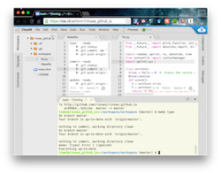

# Before we Begin

Our goals are lofty- introducing a new paradigm that combines data mining with multi-objective optimization.
And doing so in such a way that even novices can understand, use, and adapt these tools for a large range of
new tasks.

But before we can start all that, we have to handle some preliminaries.
All artists, and programmers, should start out as
apprentices. If we were painters and this was
Renaissance Italy, us apprentices would spend
decades study the ways of the masters, all the while
preparing the wooden panels for painting; agrinding
and mixing pigments; drawing preliminary sketches,
copying paintings, and casting sculptures. It was a
good system  that gave us the Michelangelo and Da
Vinci who, in turn, gave us the roof of the Sistine
Chapel and the Mona Lisa.

In terms of this book, us apprentices first have to become effective Python programmers.
The rest of this chapter offers:

+ Some notes on useful web-based programming tools
+ Some pointers on learning Python
+ Some start-up exercises to test if you have an effective Python programming environment.

## Useful On-Line Tools

### Stackoverflow

To find answers to nearly any question you'll ever want to ask about Python, go browse:

     http://stackoverflow.com/questions/tagged/python

### Github

All programmers should use off-site backup for their work. All programmers working in teams
should store their code in repositories that let them fork a branch, work separately, then
check back their changes into the main trunk.

There are many freely-available repository tools. Github is one such service that supports
the `git` repository tool.
Github has some special advantages:

+ It is the center of vast social network of programmers;
+ Github support serving static web sites straight from your Github repo.
+ Many other services offer close integration with Github (e.g. the Cloud9 tool discussed below).

For more information, go to:

     http://github.com

The good news about Github is that it is very easy to setup and configure. The bad news is that each Github
repository has a 1GB size limit. But that is certainly enough to get us started.


For Linux/Unix/Mac users, I add the following tip.
In each of your repository directories,
add a `Makefile` with the following contents. 

```
typo:   ready
        @- git status
        @- git commit -am "saving"
        @- git push origin master # update as needed

commit: ready
        @- git status
        @- git commit -a
        @- git push origin master

update: ready
        @- git pull origin master

status: ready
        @- git status

ready:
        @git config --global credential.helper cache
        @git config credential.helper \
		     'cache --timeout=3600'

timm:  # <== change to your name
        @git config --global user.name "Tim Menzies"
        @git config --global user.email \
		                       tim.menzies@gmail.com
```

This `Makefile` implements some handy shortcuts:

+ `make typo` is a quick safety save-- do this many times per day;
+ `make commit` is for making commented commits-- use this to comment any improvements .// degradation of functionality.
+ `make update` is for grabbing the latest version off the server-- do this at least at the start of each day.
+ `make status` is for finding files that are not currently known to Github.
+ `make ready` remembers your Github password for one hour-- use this if you use `make typo` a lot and you want
to save some keystrokes.
+ `make timm` should be used if Github complains that it does not know who you are.
  Before running this one, edit this rule
  to include your name and email.

Of course, there are 1000 other things you can do with a `Makefile`. For example, this book is auto-generated
by a `Makefile` that automatically extracts comments and code from my Python source code, then compiles
the comments as Markdown, then used the wonderful `pandoc` tool to compile the Markdown into Latex, then converts
the Latex to a `.pdf` file. Which is all interesting stuff-- but beyond the scope of this book.

### Cloud9

If you do not want to install code locally on your machine, then there are many readily-available
on-line integrated development environments. 

For example, to have root access to a fully-configured Unix installation, you can go to

     http://c9.io

One tip is to host your Cloud9 workspace on Github. As of June 2015, the procedure for doing that was:

+ Go to Github and create an empty repository.
+ Log in to Cloud9 using your GitHub username (at `http://c9.io`, there is a button for that, top right).
+ Hit the green _CREATE NEW WORKSPACE_ button
    + Select _Clone from URL_;
    + Find _Source URL_ and enter in `http://github.com/you/yourRepo`
	+ Wait ten seconds for the screen to change.
	+ Hit the green _START EDITING_ button. 

This will drop you into the wonderful Cloud9 integrated development environment. Here, is my editting the above
Makefile and some Python code at Cloud9.  I've just run `make typo` so all the changes to the Python file
are now backed up outside of Cloud9, over at `Github.com`.



The good news about Cloud9 is that it is very easy to setup and configure. The bad news is that each Cloud9
workspace has the same limits as Github- a 1GB size limit. Also, for CPU-intensive applications, shared
on-line resources like Cloud9 can be a little slow. That said, for the newbie,
Cloud9 is a very useful tool to jump start the learning process.

##  Python101

tutorial mater

### Why Python?

I use Python for two reasons: readability and support.
Like any computer scientist, I yearn to use more powerful languages
like LISP or Javascript or Haskell. That said,  it has to be said that good looking Python is
reads pretty
good-- no ugly brackets, indentation standards enforced by the compiler, simple keywords, etc.

Ah, you might reply, but what about other beautiful languages like CoffeeScipt or Scala or insert
yourFavoriteLanguageHere? It turns out that, at the time of this writing, that there is more tutorial
support for Python that any other language I know. Apart from the many excellent Python textbooks,
the on-line community for Python is very active and very helpful; e.g. see stackoverlow.com.


### Installing a ``Good'' Python Environment


### Python Standards

This textbook uses Python 2.7 for its code base. Of course, it is tempting to use Python3 but there
are still too many Python packages out there t

## Mantras


### "Do go coding, go for feedback"

### "Red, Green, Refactor"

### "Write Less Code"

Holzmann. true

### "Stop writing classes"

Jack Diederich

## Homework

### Homework1

+ Do: get an account at `http://github.com`. Hand-in: your Github id.


